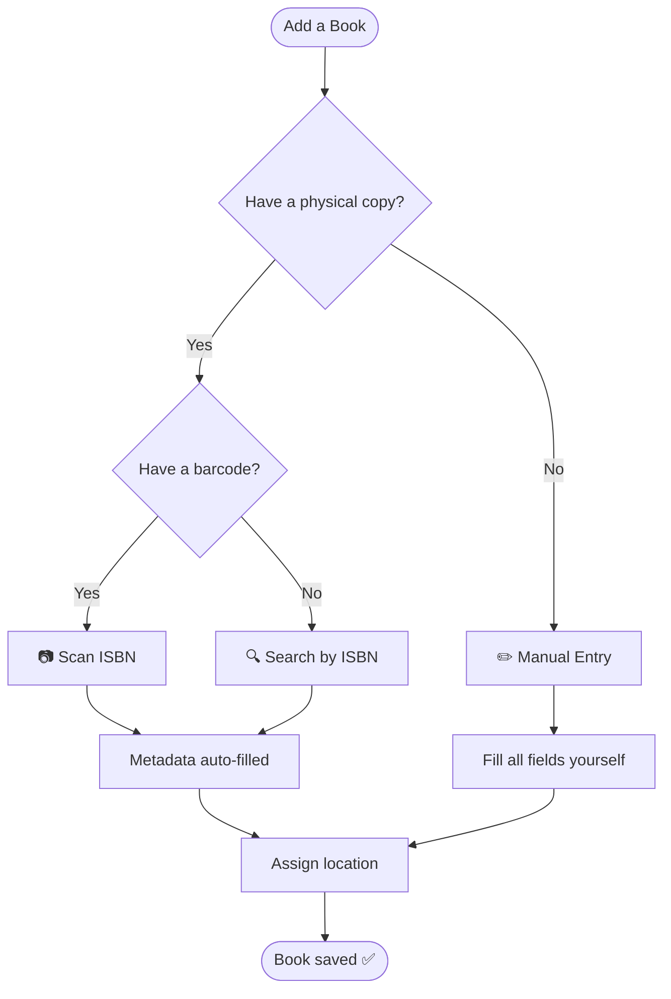

# Managing Your Library

This section covers everything about adding, editing, and organising your book collection in Jinbocho.

---

## The Three Ways to Add a Book

Jinbocho offers three methods to add books. Choose the one that fits your situation:

---

## Method 1: Scan an ISBN Barcode

The fastest way to add a book you're holding in your hands.

### Steps

1. Click **Add Book** (the + button in the top-right corner)
2. Tap **Scan ISBN** — your browser will request camera permission
3. Point the camera at the barcode on the back of the book
4. Jinbocho reads the ISBN and looks it up automatically
5. Review the pre-filled metadata (title, author, publisher, cover)
6. Choose a location (room → bookcase → section → shelf)
7. Click **Save**

!!! tip "Camera tip"
    Hold the book 15–25 cm from the camera in good lighting. The barcode
    does not need to be perfectly centred — just fully in frame.

!!! info "No internet? No problem"
    If a book was looked up before, its metadata is cached locally.
    Subsequent scans of the same ISBN work without an external call.

See the dedicated **[ISBN Scanning](07-isbn-scanning.md)** page for detailed guidance, including mobile tips.

---

## Method 2: Enter an ISBN Manually

Use this when you have the ISBN but no working camera.

1. Click **Add Book**
2. Select **Enter ISBN**
3. Type or paste the ISBN (10 or 13 digits, with or without dashes)
4. Click **Look Up** — metadata is filled in automatically
5. Assign a location and click **Save**

!!! example "ISBN formats accepted"
    All three formats are valid:

    - `9788845292613`
    - `978-88-452-9261-3`
    - `8845292614` (10-digit ISBN)

---

## Method 3: Manual Entry

For books with no ISBN (very old editions, handwritten notes, manuscripts) or when you want full control over metadata.

1. Click **Add Book**
2. Select **Manual Entry**
3. Fill in the required fields:

| Field | Required | Description |
|-------|----------|-------------|
| Title | ✅ | Full title including subtitle |
| Author | ✅ | One or more authors |
| Language | ✅ | Publication language |
| ISBN | — | Leave blank if unknown |
| Publisher | — | Publishing house name |
| Published date | — | Year or full date |
| Page count | — | Number of pages |
| Description | — | Short synopsis or notes |

4. Assign a location
5. Click **Save**

---

## If a Book Already Exists in Your Family Library

Whichever method you use, Jinbocho checks the whole family's library before
adding a new book — not just your own books. If it finds a match by **ISBN**
or by **title and author**, you'll see a dialog telling you:

- Which existing book it matches
- Who in the family already owns a copy
- Where that copy is shelved

This is just a heads-up, not a block. Owning two copies of the same book under
different family members is common and fully supported — for example, you and
your partner may each have bought your own copy. You can:

- **Confirm** — add your copy anyway, as a separate book in the library
- **Cancel** — go back without adding it, e.g. if you realise it's already yours

---

## Editing a Book

To change metadata or move a book to a different shelf:

1. Find the book in your library (search or browse)
2. Click the book card to open its detail page
3. Click the **Edit** button (pencil icon)
4. Modify any field
5. Click **Save Changes**

!!! warning "Changing the ISBN"
    Changing the ISBN of an existing record will trigger a new external lookup
    and overwrite title, author, and other metadata. Your reading status and
    location are preserved.

---

## Moving a Book to a New Location

You can update a book's position without editing all its metadata:

1. Open the book's detail page
2. Click **Change Location**
3. Select new room → bookcase → section → shelf → position
4. Confirm — the move is recorded in the **audit log**

---

## Deleting a Book

Deleting removes the book copy from your library. The bibliographic record
(ISBN, title, author) is kept in the database in case other family members
have the same book.

1. Open the book's detail page
2. Click **Delete** (trash icon)
3. Confirm the deletion in the dialog

!!! danger "This cannot be undone"
    Once confirmed, the book is permanently removed. There is no recycle bin.

---

## Organising Your Library

Once books are added, keep your collection tidy:

- **By location** — browse the Locations section (left sidebar) to see all books in a room or bookcase
- **By reading status** — filter by "Want to read", "Reading", "Finished"
- **By search** — find any book in seconds with full-text search

See **[Search & Filters](06-search-filters.md)** and **[Locations](04-locations.md)** for details.
