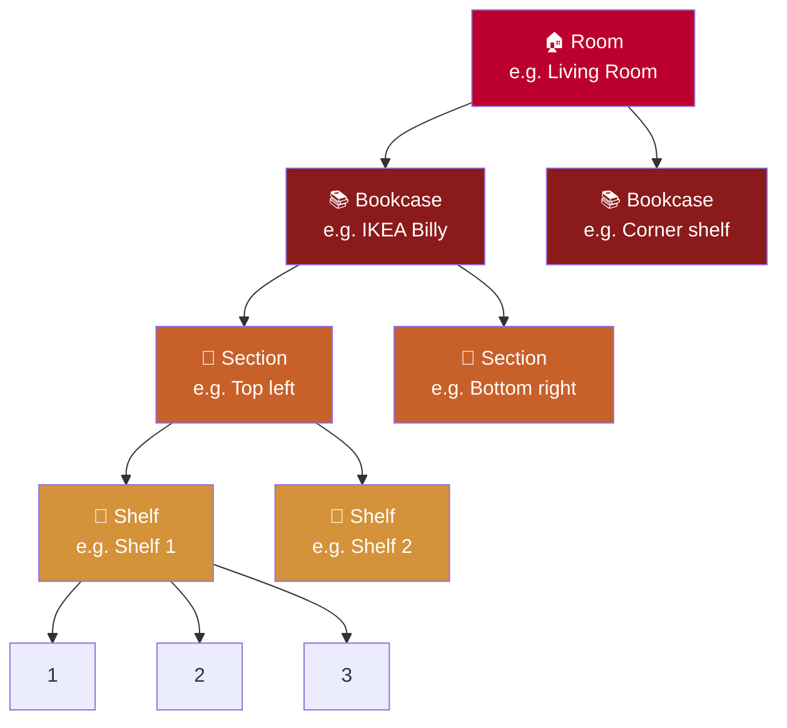

# Locations

Jinbocho models your home's physical structure so you always know exactly where every book is.

---

## The Location Hierarchy

Your home is represented as a four-level tree:



| Level | What it represents | Example |
|-------|--------------------|---------|
| **Room** | A physical room in your home | Living room, Study, Bedroom |
| **Bookcase** | A piece of furniture inside a room | IKEA Billy, Wooden cabinet |
| **Section** | A zone within a bookcase | Top shelf area, Left column |
| **Shelf** | A single horizontal shelf | Shelf 1, Shelf 2 |
| **Position** | A numbered slot on a shelf | 1, 2, 3 … |

!!! info "You can skip levels"
    If your bookcases have no sections, you can go Room → Bookcase → Shelf
    without creating Sections. Jinbocho adapts to how your home is actually organised.

---

## Setting Up Locations

### Add a Room

1. Open the **Locations** section from the sidebar
2. Click **+ New Room**
3. Enter a name (e.g. "Studio") and optional description
4. Click **Save**

### Add a Bookcase

1. Navigate into a Room
2. Click **+ New Bookcase**
3. Enter a name (e.g. "IKEA Billy") and optional notes
4. Click **Save**

### Add a Section

1. Navigate into a Bookcase
2. Click **+ New Section**
3. Enter a descriptive name (e.g. "Left column", "Upper half")
4. Click **Save**

### Add a Shelf

1. Navigate into a Section (or directly into a Bookcase if you skipped Sections)
2. Click **+ New Shelf**
3. Enter a name (e.g. "Shelf 1") and optional capacity
4. Click **Save**

---

## Browsing Books by Location

### Location Tree View

The sidebar shows your full location tree. Click any node to see all books at that level:

- Click a **Room** → see all books in that room
- Click a **Bookcase** → see books in that bookcase only
- Click a **Shelf** → see books in exact position order

### Shelf View (Ordered)

When you open a Shelf, books appear in their **position order** — the same order they sit on the physical shelf. This makes it easy to find a book by position number when you're standing in front of the bookcase.

```
Shelf 2 — Living Room › Billy › Upper section › Shelf 2

 [1] The Name of the Wind     Patrick Rothfuss
 [2] The Wise Man's Fear      Patrick Rothfuss
 [3] Il deserto dei Tartari   Dino Buzzati
 [4] —
 [5] Il barone rampante       Italo Calvino
```

!!! tip "Gaps in positions are allowed"
    Positions don't have to be consecutive. Leaving position 4 empty means
    there's a physical gap on your shelf (a book lent out, for instance).

!!! tip "Cataloging or checking a whole shelf at once"
    From the **Bookcase Map**, each shelf has **Scan** and **Audit** buttons:
    Scan photographs the shelf and bulk-adds every book AI recognises, already
    positioned; Audit compares a photo against what's already catalogued there
    and flags anything missing or misfiled. See
    **[Shelf Scan & Shelf Audit](07-isbn-scanning.md#shelf-scan-photograph-a-whole-shelf)**.

---

## Editing and Renaming Locations

1. Navigate to the location you want to edit
2. Click the **pencil icon** next to the name
3. Update the name or description
4. Click **Save**

---

## Deleting a Location

!!! warning "Books must be relocated first"
    You cannot delete a Room, Bookcase, Section, or Shelf that still contains
    books. Move or delete all books before removing the location.

1. Ensure the location is empty
2. Click the **trash icon** next to the location name
3. Confirm the deletion

---

## Tips for Organising Locations

=== "Small home library (1–2 bookcases)"

    Keep it simple:

    ```
    Room: Living Room
      Bookcase: Main Shelf
        Shelf 1 (A–G)
        Shelf 2 (H–M)
        Shelf 3 (N–Z)
    ```

=== "Medium library (3–10 bookcases)"

    Add sections to group shelves logically:

    ```
    Room: Study
      Bookcase: IKEA Billy
        Section: Fiction
          Shelf 1, Shelf 2, Shelf 3
        Section: Non-fiction
          Shelf 1, Shelf 2
      Bookcase: Corner unit
        Shelf 1 (Art books)
        Shelf 2 (Comics)
    ```

=== "Large library (10+ bookcases)"

    Use full hierarchy and multiple rooms:

    ```
    Room: Library
      Bookcase: A (Classics)
      Bookcase: B (Science)
      Bookcase: C (History)
    Room: Bedroom
      Bookcase: Bedside table
    Room: Kids' room
      Bookcase: Children's books
    ```
