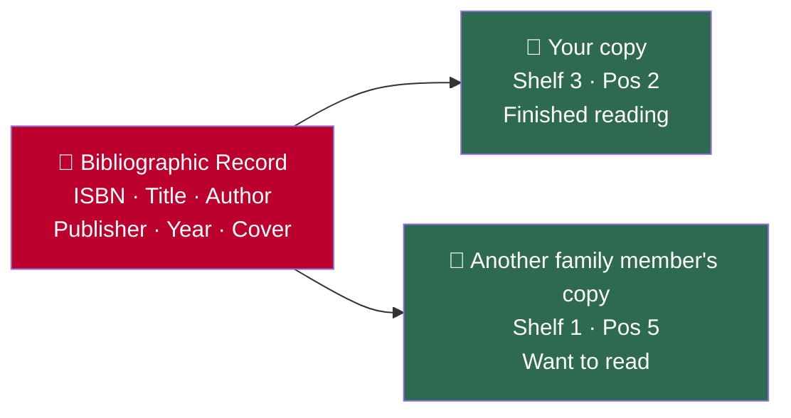
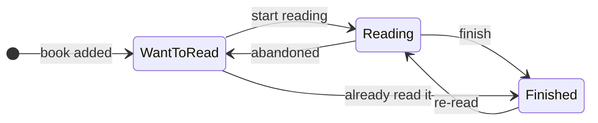

# Book Details

Every book in Jinbocho has two layers of information: the **bibliographic record**
(what the book is) and the **owned copy** (your physical copy and its history).

---

## Bibliographic Record vs Owned Book

| Bibliographic Record | Owned Book (your copy) |
|---------------------|------------------------|
| Title, author, ISBN | Which shelf it's on |
| Publisher, year, pages | Position on that shelf |
| Cover image, language | Reading status |
| Description | Date added, last moved |
| Genre tags | Audit history |

!!! info "Why two separate things?"
    Multiple family members can own the same book. Each has their own copy
    record (with their own reading status and location), but they all share
    one bibliographic record. This avoids duplicate metadata.

---

## Opening a Book's Detail Page

From any book list or search result, click the book card. The detail page shows:

### Left panel — Metadata

- **Cover** (thumbnail, from Open Library or Google Books)
- **Title and Author**
- **ISBN** (13-digit)
- **Publisher** and **Year**
- **Pages**
- **Language**
- **Description/synopsis**
- **Presentation** — a short, spoiler-free blurb to help you decide what to read. See **[Book Presentation](15-book-presentation.md)**.

### Right panel — Your copy

- **Location breadcrumb** — Room › Bookcase › Section › Shelf · Position X
- **Reading status** (badge with colour)
- **Date added**
- **Audit log** (move history and status changes)

---

## Your Copy's Own Attributes

Beyond location and reading status, each owned copy carries its own details —
separate from the bibliographic record, so they don't affect other family
members' copies of the same book:

| Field | What it's for |
|-------|----------------|
| **Tags** | Free-form labels you choose (e.g. "signed", "to lend", "favourite") — shown as badges on the detail page |
| **Condition** | New, Good, Fair, or Poor |
| **Source** | Purchased, Gift, Borrowed, or Other |
| **Purchase date** and **price** | Optional, for your own records |
| **Owner** | Which family member this physical copy belongs to |
| **Notes** | Free-text notes about this specific copy |

To edit them: open the book detail page → **Edit** → see the **"This copy"**
section of the edit form (the fields above the shared book details).

### Who's Reading It Right Now

If a copy's status is **Reading**, the detail page shows a 📖 badge next to
the status with the name of the family member currently reading it. This is
separate from the per-member read history — see
**[Reading Progress → Who Read This Book](10-reading-progress.md#who-read-this-book-family-reads)**.

If the copy is lent to someone outside the family, a 📤 badge shows who has
it on loan — see **[Loans](16-loans.md)**.

---

## Reading Status

Each copy has one of three reading statuses:

| Status | Colour | Meaning |
|--------|--------|---------|
| **Want to read** | 🔵 Blue | In your to-read pile |
| **Reading** | 🟡 Yellow | Currently reading |
| **Finished** | 🟢 Green | Completed |

### Changing Reading Status

1. Open the book detail page
2. Click the status badge
3. Select a new status from the dropdown
4. The change is saved immediately and recorded in the audit log

---

## Changing a Book's Location

1. Open the book detail page
2. Click **Change Location** (or the pencil icon next to the location breadcrumb)
3. Use the location picker to select:
   - Room
   - Bookcase
   - Section (if applicable)
   - Shelf
   - Position (slot number on the shelf)
4. Click **Confirm Move**

The move is recorded in the audit log with a timestamp.

---

## Editing Metadata

1. Open the book detail page
2. Click **Edit** (pencil icon at the top)
3. Modify any field:
   - Title, author, publisher, year, pages, language, description
   - Cover image URL (paste a direct image link)
4. Click **Save Changes**

!!! note "ISBN is read-only after creation"
    To avoid breaking the link between records and external lookups,
    the ISBN field cannot be changed after a book is created.
    Delete and re-add the book if the ISBN was entered incorrectly.

---

## Audit Log

Every change to a book is recorded:

| Event | What gets logged |
|-------|------------------|
| Book added | User, timestamp, initial location |
| Location changed | Old location → new location, user, timestamp |
| Reading status changed | Old status → new status, user, timestamp |
| Metadata edited | Which fields changed, user, timestamp |

The audit log is visible at the bottom of the book detail page. It cannot be deleted.

!!! tip "Useful for shared libraries"
    In a family library, the audit log tells you who moved a book and when —
    handy when a book is missing from its expected shelf.

---

## Cover Images

Covers are fetched automatically during ISBN lookup. If a cover is missing:

1. Open the book detail page → **Edit**
2. Paste a direct image URL in the **Cover URL** field
3. Click **Save Changes**

Accepted formats: JPEG, PNG, WebP. The image is not uploaded to Jinbocho — it is fetched from the URL every time the book is displayed.

---

## Deleting a Book

See **[Managing Your Library → Deleting a Book](03-managing-library.md#deleting-a-book)**.
