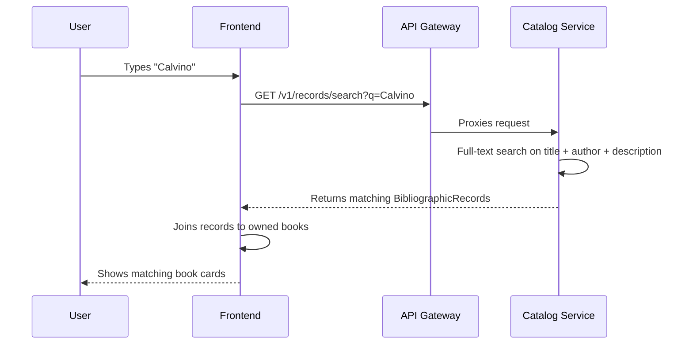

# Search & Filters

Jinbocho's search covers your entire library — titles, authors, ISBNs, publishers,
and descriptions — in real time.

---

## Quick Search

The search bar is always visible at the top of the page.

1. Click the search bar (or press `/` on desktop)
2. Start typing — results appear as you type
3. Click a result to open the book detail page

### What is searched

| Field | Searched |
|-------|----------|
| Title | ✅ |
| Author | ✅ |
| ISBN | ✅ (exact match) |
| Publisher | ✅ |
| Description | ✅ |
| Location | — (use sidebar navigation instead) |

---

## Advanced Filters

Click the **Filters** button next to the search bar to open the filter panel.

### Filter by Reading Status

Show only books with a specific status:

| Filter | Shows |
|--------|-------|
| All | Every book |
| Want to read | Your to-read pile |
| Reading | Books in progress |
| Finished | Completed books |

### Filter by Location

Narrow results to a specific place in your home:

- Select a **Room** to see all books in that room
- Select a **Bookcase** to narrow further
- Select a **Shelf** to see books in exact position order

!!! tip "Combine filters"
    You can combine a search query with filters. For example:
    type "Tolkien" and filter by "Finished" to see all Tolkien books you've read.

### Filter by Language

If your library has books in multiple languages, filter to show only one language at a time.

### Filter by Year

Enter a year range to find books from a specific period (e.g. all books published between 1960 and 1980).

---

## Sorting

Use the **Sort** dropdown to change how results are ordered:

| Sort option | Order |
|-------------|-------|
| Title A–Z | Alphabetical by title (default) |
| Title Z–A | Reverse alphabetical |
| Author A–Z | Alphabetical by author surname |
| Recently added | Newest additions first |
| Year (oldest first) | Publication year ascending |
| Year (newest first) | Publication year descending |

---

## Browsing Without Searching

If you prefer to explore rather than search:

- **All Books** (sidebar) — flat list of your entire collection
- **Locations** (sidebar) — browse by room and bookcase
- **Reading** (sidebar) — filter by reading status directly from the sidebar
- **Recently Added** — shows the last 20 books added

---

## Keyboard Shortcuts (Desktop)

| Shortcut | Action |
|----------|--------|
| `/` | Focus the search bar |
| `Esc` | Clear search / close results |
| `↑` / `↓` | Navigate search results |
| `Enter` | Open the selected result |

---

## Tips for Finding Books Fast

=== "You know the author"
    Type the author's name. Partial names work — "buz" finds "Buzzati".

=== "You know the ISBN"
    Type or scan the full ISBN — it returns an exact match.

=== "You remember a word in the title"
    Type any word from the title. Accents are matched: "deserto" finds "Il deserto dei Tartari".

=== "You know roughly where it is"
    Use the Locations sidebar tree. Expand Room → Bookcase → Shelf to browse physically.

=== "You want to find your next read"
    Filter by **Want to read** to see your entire to-read pile.
