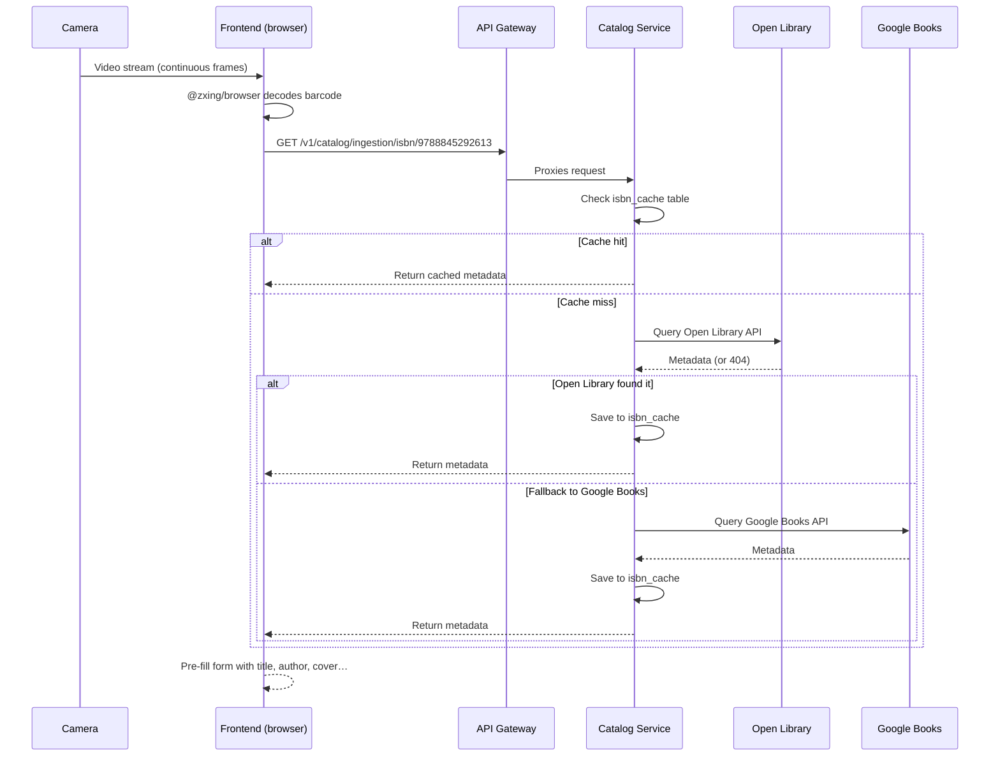

# ISBN Scanning

The barcode scanner is the fastest way to add books to your library.
Jinbocho uses your device camera to read ISBN barcodes directly in the browser —
no app installation required.

---

## How It Works



---

## Starting the Scanner

1. Click **Add Book** (the `+` button)
2. Choose **Scan ISBN**
3. If this is the first time, your browser will ask for **camera permission** — click **Allow**
4. Point the camera at the barcode

### Camera permission

Different browsers ask for camera permission differently:

=== "Chrome / Edge"
    A permission dialog appears in the top-left of the browser window.
    Click **Allow**. The permission is remembered for the site.

=== "Safari (macOS)"
    Safari asks once per session. Click **Allow** in the dialog.

=== "Safari (iOS)"
    Go to **Settings → Safari → Camera** and set it to **Allow**.

=== "Firefox"
    Click **Allow** in the dialog that appears at the top of the page.

!!! warning "HTTPS required"
    Camera access only works on secure connections (HTTPS).
    The production Jinbocho app is always HTTPS. During local development,
    use `http://localhost` (browsers allow camera on localhost without HTTPS).

---

## Scanning Tips

### Distance and angle

```
        ┌──────────────────────────────────────┐
        │                                      │
        │   ▐▌▐▌▐▌▐▌▐▌▐▌▐▌▐▌▐▌▐▌▐▌▐▌▐▌▐▌▐▌   │
        │   ▐▌▐▌▐▌▐▌▐▌▐▌▐▌▐▌▐▌▐▌▐▌▐▌▐▌▐▌▐▌   │
        │   ▐▌▐▌▐▌▐▌▐▌▐▌▐▌▐▌▐▌▐▌▐▌▐▌▐▌▐▌▐▌   │
        │                                      │
        └──────────────────────────────────────┘
             ↑ ideal: full barcode visible, parallel to screen
```

| What works | What doesn't |
|-----------|---------------|
| 15–25 cm distance | Too close (blurry) |
| Barcode fully in frame | Barcode partially cut off |
| Good ambient lighting | Low light / glare |
| Barcode perpendicular to lens | Extreme angle (> 45°) |
| Steady hand (brief pause) | Very shaky |

!!! tip "Use the back camera on mobile"
    The back (rear) camera has a much better sensor than the front camera.
    Jinbocho defaults to the back camera automatically on mobile.

### If the scan isn't working

1. **Clean the camera lens** — fingerprints cause blur
2. **Improve lighting** — turn on a light or move near a window
3. **Hold steadier** — rest your elbow on a surface
4. **Try different distance** — move a little closer or further
5. **Fallback**: type the ISBN manually using **Enter ISBN** instead

---

## What Happens After a Successful Scan

Once the barcode is detected:

1. The camera view closes
2. Jinbocho shows a loading indicator while fetching metadata
3. The **Add Book form** opens with fields pre-filled:
   - Title
   - Author(s)
   - Publisher
   - Publication year
   - Page count
   - Language
   - Cover image (if available)
4. Review the information
5. Choose a location (room → bookcase → shelf)
6. Click **Save**

!!! note "Metadata accuracy"
    ISBN metadata comes from Open Library and Google Books.
    Occasionally details are incomplete or incorrect — you can edit
    any field before saving.

---

## Scanning Multiple Books in a Row

After saving one book, the scanner does **not** reopen automatically.
To scan another book:

1. Click **Add Book** → **Scan ISBN** again, or
2. Use the **Scan another** button shown on the confirmation screen

For adding a whole shelf of books, this workflow is efficient:

```
Scan → Review → Save → Scan → Review → Save …
(each cycle takes about 10 seconds)
```

---

## Shelf Scan: Photograph a Whole Shelf

If AI is enabled on your Jinbocho instance, you don't have to scan books one
barcode at a time. **Shelf Scan** reads every spine in a single photo and
proposes each book for you to confirm.

!!! info "Requires AI with a vision-capable model"
    Shelf Scan only appears if your instance's AI module is enabled **and**
    configured with a model that can read images. If it's not available, you
    won't see the option — ask your administrator, or fall back to regular
    ISBN scanning above.

### Starting a Shelf Scan

You can start a scan from two places:

- **Bookcase Map** — open the map for a bookcase, click **Scan** next to the
  shelf you want to catalogue
- **Add Book → Scan a whole shelf** — pick the shelf first, then take the photo

### Steps

1. Pick the shelf you're photographing (pre-filled if you started from the map)
2. Take **one photo** of the shelf — on mobile this opens your camera directly
3. Wait for AI to read the spines — for a full shelf this can take **a couple
   of minutes**, so don't close the tab
4. Review the results: each detected book is shown as one of:

    | Status | Meaning |
    |--------|---------|
    | ✅ Matched | AI is confident about title and author |
    | ⚠️ Uncertain | AI has a guess, but you should double-check it |
    | ❌ Not found | A spine was detected but couldn't be identified — edit it manually or skip it |

5. Edit any title/author that's wrong, and uncheck any book you don't want to add
6. Books that look like duplicates — either a copy you already own, or the same
   spine detected twice in the photo — are flagged and excluded from the count
   by default; re-select them if you really do want a second copy
7. Click **Add N books** — every selected book is created already positioned on
   that shelf

!!! tip "Why it's slower than a single scan"
    Reading an entire shelf photo is a much heavier AI task than looking up one
    ISBN, which is why it can take one to two minutes for a full shelf. This is
    expected — let it finish rather than retrying.

### If AI Isn't Available

Depending on what's misconfigured, you'll see one of these instead of the Scan
button or after trying to use it:

- *"AI photo scanning isn't configured for this library"* — the AI module isn't enabled at all
- *"The configured AI model can't read photos"* — AI is enabled, but the model in use has no vision support; ask your administrator to configure a vision-capable model
- A generic error — AI is temporarily unavailable; try again later, or add the books manually

---

## Shelf Audit: Check an Already-Catalogued Shelf

**Shelf Audit** is the opposite of Shelf Scan: instead of adding new books, it
checks a shelf you've *already* catalogued against what's physically there
right now, and tells you what changed.

1. Open the Bookcase Map, click **Audit** next to the shelf
2. Take a photo of the shelf as it currently looks
3. Jinbocho compares the photo to what's recorded on that shelf and reports:

    | Result | Meaning | What you can do |
    |--------|---------|-------------------|
    | **Missing** | Catalogued on this shelf, but not seen in the photo | It may have been moved, lent out, or lost — **View** the book to check |
    | **Unexpected** | Seen in the photo, but not catalogued on this shelf | It may be misfiled — **Add here** if it belongs, or **Search library** to find where it's supposed to be |

This is a good way to catch books that were physically moved without updating
Jinbocho, or that were lent out and never marked as returned.

---

## Shelf Mode: Rapid Barcode Scanning for One Shelf

If you're adding many books to the **same** shelf and prefer scanning barcodes
over AI photos, **Shelf Mode** locks in the destination location for the whole
session so you don't have to re-pick it after every book:

1. Click **Add Book** → **Scan a shelf** (Shelf Mode)
2. Choose the room → bookcase → section → shelf once
3. Scan (or type) one ISBN after another — each book is saved straight to that
   shelf without asking for a location again
4. Close Shelf Mode when you're done with that shelf

If AI is available, Shelf Mode also offers a one-tap shortcut to switch to
**Shelf Scan** instead — take a single photo of the whole shelf and it's sent
straight into the Shelf Scan review flow.

---

## ISBN Formats

Jinbocho recognises:

| Format | Example | Notes |
|--------|---------|-------|
| EAN-13 barcode | Standard back-cover barcode | Most modern books |
| ISBN-13 (text) | `9788845292613` | Same as EAN-13, typed |
| ISBN-10 (text) | `8845292614` | Older books, converted internally |
| Dashes ignored | `978-88-452-9261-3` | Dashes are stripped before lookup |

---

## When a Book Is Not Found

If the ISBN is not in Open Library or Google Books, Jinbocho shows:

> "No metadata found for this ISBN. You can add the book manually."

Click **Add manually** to open the manual entry form with the ISBN pre-filled.
Fill in the title and author yourself.

This is common for:
- Very old books (pre-1970)
- Limited regional editions
- Self-published books
- Books from small publishers outside the major databases

---

## Privacy Note

The camera feed is processed **entirely in your browser** by the `@zxing/browser`
library. No video frames are sent to any server. Only the decoded ISBN number
is sent to the Jinbocho API to look up metadata.
