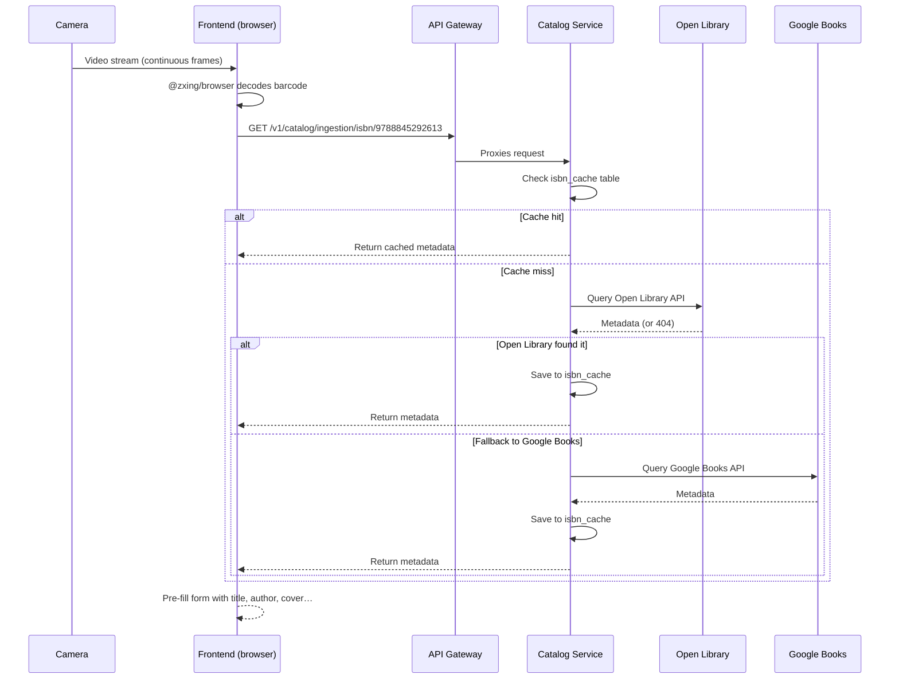

# ISBN Scanning

The barcode scanner is the fastest way to add books to your library.
Jinbocho uses your device camera to read ISBN barcodes directly in the browser —
no app installation required.

---

## How It Works



---

## Starting the Scanner

1. Click **Add Book** (the `+` button)
2. Choose **Scan ISBN**
3. If this is the first time, your browser will ask for **camera permission** — click **Allow**
4. Point the camera at the barcode

### Camera permission

Different browsers ask for camera permission differently:

=== "Chrome / Edge"
    A permission dialog appears in the top-left of the browser window.
    Click **Allow**. The permission is remembered for the site.

=== "Safari (macOS)"
    Safari asks once per session. Click **Allow** in the dialog.

=== "Safari (iOS)"
    Go to **Settings → Safari → Camera** and set it to **Allow**.

=== "Firefox"
    Click **Allow** in the dialog that appears at the top of the page.

!!! warning "HTTPS required"
    Camera access only works on secure connections (HTTPS).
    The production Jinbocho app is always HTTPS. During local development,
    use `http://localhost` (browsers allow camera on localhost without HTTPS).

---

## Scanning Tips

### Distance and angle

```
        ┌──────────────────────────────────────┐
        │                                      │
        │   ▐▌▐▌▐▌▐▌▐▌▐▌▐▌▐▌▐▌▐▌▐▌▐▌▐▌▐▌▐▌   │
        │   ▐▌▐▌▐▌▐▌▐▌▐▌▐▌▐▌▐▌▐▌▐▌▐▌▐▌▐▌▐▌   │
        │   ▐▌▐▌▐▌▐▌▐▌▐▌▐▌▐▌▐▌▐▌▐▌▐▌▐▌▐▌▐▌   │
        │                                      │
        └──────────────────────────────────────┘
             ↑ ideal: full barcode visible, parallel to screen
```

| What works | What doesn't |
|-----------|---------------|
| 15–25 cm distance | Too close (blurry) |
| Barcode fully in frame | Barcode partially cut off |
| Good ambient lighting | Low light / glare |
| Barcode perpendicular to lens | Extreme angle (> 45°) |
| Steady hand (brief pause) | Very shaky |

!!! tip "Use the back camera on mobile"
    The back (rear) camera has a much better sensor than the front camera.
    Jinbocho defaults to the back camera automatically on mobile.

### If the scan isn't working

1. **Clean the camera lens** — fingerprints cause blur
2. **Improve lighting** — turn on a light or move near a window
3. **Hold steadier** — rest your elbow on a surface
4. **Try different distance** — move a little closer or further
5. **Fallback**: type the ISBN manually using **Enter ISBN** instead

---

## What Happens After a Successful Scan

Once the barcode is detected:

1. The camera view closes
2. Jinbocho shows a loading indicator while fetching metadata
3. The **Add Book form** opens with fields pre-filled:
   - Title
   - Author(s)
   - Publisher
   - Publication year
   - Page count
   - Language
   - Cover image (if available)
4. Review the information
5. Choose a location (room → bookcase → shelf)
6. Click **Save**

!!! note "Metadata accuracy"
    ISBN metadata comes from Open Library and Google Books.
    Occasionally details are incomplete or incorrect — you can edit
    any field before saving.

---

## Scanning Multiple Books in a Row

After saving one book, the scanner does **not** reopen automatically.
To scan another book:

1. Click **Add Book** → **Scan ISBN** again, or
2. Use the **Scan another** button shown on the confirmation screen

For adding a whole shelf of books, this workflow is efficient:

```
Scan → Review → Save → Scan → Review → Save …
(each cycle takes about 10 seconds)
```

---

## ISBN Formats

Jinbocho recognises:

| Format | Example | Notes |
|--------|---------|-------|
| EAN-13 barcode | Standard back-cover barcode | Most modern books |
| ISBN-13 (text) | `9788845292613` | Same as EAN-13, typed |
| ISBN-10 (text) | `8845292614` | Older books, converted internally |
| Dashes ignored | `978-88-452-9261-3` | Dashes are stripped before lookup |

---

## When a Book Is Not Found

If the ISBN is not in Open Library or Google Books, Jinbocho shows:

> "No metadata found for this ISBN. You can add the book manually."

Click **Add manually** to open the manual entry form with the ISBN pre-filled.
Fill in the title and author yourself.

This is common for:
- Very old books (pre-1970)
- Limited regional editions
- Self-published books
- Books from small publishers outside the major databases

---

## Privacy Note

The camera feed is processed **entirely in your browser** by the `@zxing/browser`
library. No video frames are sent to any server. Only the decoded ISBN number
is sent to the Jinbocho API to look up metadata.
