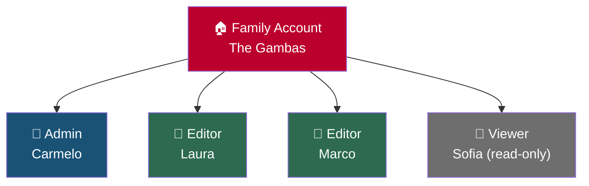
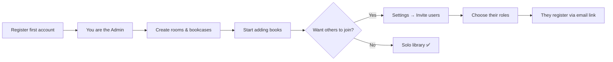

# User Management

Jinbocho is designed for families. Every book collection belongs to a **family account**,
and multiple family members can use the same library with different permission levels.

---

## Families and Users

All books, locations, and reading history belong to the **family** — not to individual users.
Every family member sees the same library. Roles control what each person can do.

---

## Roles

| Role | Can view | Can add/edit books | Can manage locations | Can manage users | Can delete |
|------|---------|-------------------|---------------------|-----------------|------------|
| **Admin** | ✅ | ✅ | ✅ | ✅ | ✅ |
| **Editor** | ✅ | ✅ | ✅ | — | ✅ |
| **Viewer** | ✅ | — | — | — | — |

### Admin

Full access to everything. Each family must have at least one Admin.
The first user who registers is automatically an Admin.

Use this role for: the family member who manages the account.

### Editor

Can add, edit, move, and delete books. Can create and rename locations.
Cannot invite new members or change other users' roles.

Use this role for: family members who actively maintain the library.

### Viewer

Read-only access. Can search and browse the full library but cannot
make any changes.

Use this role for: children, guests, or family members who just want to look things up.

---

## Inviting a New Family Member

!!! info "Admin required"
    Only Admins can invite new users.

1. Go to **Settings → Users**
2. Click **Invite User**
3. Enter the new member's email address
4. Choose their role: Admin, Editor, or Viewer
5. Click **Send Invitation**

The invited person receives an email with a registration link.
When they click it and create their account, they are automatically
linked to your family.

!!! note "Email delivery"
    Invitation emails may land in spam. Ask the invited person to check
    their spam folder if they don't receive it within a few minutes.

---

## Changing a User's Role

!!! info "Admin required"

1. Go to **Settings → Users**
2. Find the user in the list
3. Click the role dropdown next to their name
4. Select the new role
5. The change takes effect immediately — their next request uses the new role

---

## Removing a User

!!! info "Admin required"

1. Go to **Settings → Users**
2. Find the user in the list
3. Click **Remove** (trash icon)
4. Confirm the removal

!!! warning "What happens to their data"
    Removing a user does not delete any books or locations.
    Books they added remain in the family library.
    Their audit log entries remain for traceability.

---

## Your Profile

Every user can update their own profile:

1. Click your name or avatar (top-right corner)
2. Select **Profile**
3. Update:
   - Display name
   - Email address
   - Interface language (see **[Language & Localization](12-localization.md)**)
4. Click **Save**

---

## Changing Your Password

1. Click your name or avatar → **Profile**
2. Click **Change Password**
3. Enter your current password
4. Enter and confirm your new password
5. Click **Update Password**

!!! tip "Password requirements"
    Passwords must be at least 8 characters. Using a long passphrase
    (e.g. "LibraryOfTheWinter2026!") is better than a short random string.

---

## Family Settings

Admins can update the family-level settings:

1. Go to **Settings**
2. In the **Family** section, update:
   - **Family name** (shown at the top of the library)
   - **Description** (optional notes about the family)
3. Click **Save**

---

## Security: Sessions

Jinbocho uses JWT tokens for authentication. Your session is automatically
refreshed while you're active. After 30 minutes of inactivity, you will
need to log in again.

To end your session on the current device, use **Logout** from the Settings page.
Each device holds its own session token — logging out on one device does not affect other devices.

---

## First-Time Setup: Building the Family

