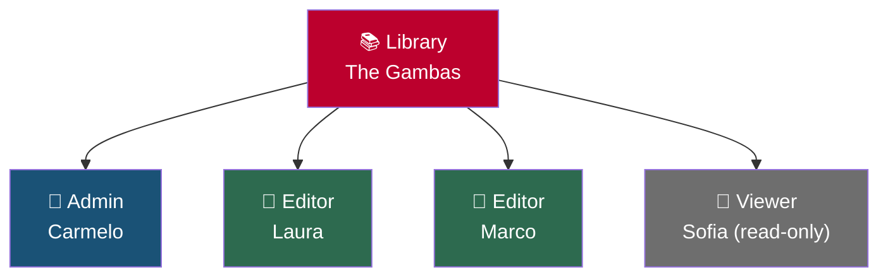
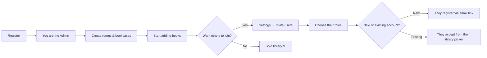

# User Management

Every book collection in Jinbocho belongs to a **library**, and multiple people
can use the same library with different permission levels. A single person can
also belong to more than one library at once — see
**[Authentication → Belonging to Multiple Libraries](02-authentication.md#belonging-to-multiple-libraries)**.

---

## Libraries and Members

All books, locations, and reading history belong to the **library** — not to
individual users. Every member sees the same library. Roles control what each
person can do, and are set **per library**: the same person can be Admin in
one library and Viewer in another.

---

## Roles

| Role | Can view | Can add/edit books | Can manage locations | Can manage users | Can delete |
|------|---------|-------------------|---------------------|-----------------|------------|
| **Admin** | ✅ | ✅ | ✅ | ✅ | ✅ |
| **Editor** | ✅ | ✅ | ✅ | — | ✅ |
| **Viewer** | ✅ | — | — | — | — |

### Admin

Full access to everything, including inviting/removing/suspending members and
deleting the library itself. Each library must have at least one Admin.
The first user who registers a library is automatically its Admin.

Use this role for: the person who manages the library.

### Editor

Can add, edit, move, and delete books. Can create and rename locations.
Cannot invite new members, change roles, or delete the library.

Use this role for: members who actively maintain the collection.

### Viewer

Read-only access. Can search and browse the full library but cannot
make any changes.

Use this role for: children, guests, or members who just want to look things up.

---

## Inviting a New Member

!!! info "Admin required"
    Only Admins can invite new members.

1. Go to **Settings → Users**
2. Click **Invite User**
3. Start typing the person's name or email:
    - If they already have a Jinbocho account, a suggestion list appears —
      pick them directly (you'll see an "existing user" badge, and no separate
      name field is needed)
    - Otherwise, enter their email address as free text
4. Choose their role: Admin, Editor, or Viewer
5. Click **Send Invitation**

**What happens next depends on whether they already have an account:**

- **New to Jinbocho**: they receive an email with a registration link. Creating
  their account links them to your library automatically.
- **Existing Jinbocho user**: no email is sent. The invitation shows up under
  **Pending invites** the next time they open the
  **[library picker](02-authentication.md#belonging-to-multiple-libraries)** —
  they accept or decline it from there.

!!! note "Email delivery"
    Invitation emails may land in spam. Ask the invited person to check
    their spam folder if they don't receive it within a few minutes.

---

## Changing a Member's Role

!!! info "Admin required"

1. Go to **Settings → Users**
2. Find the member in the list
3. Click the role dropdown next to their name
4. Select the new role
5. The change takes effect immediately — their next request uses the new role

This only changes their role in **this** library — if they belong to others,
those roles are unaffected.

---

## Suspending vs. Removing a Member

!!! info "Admin required"

Jinbocho gives you two ways to take away a member's access, depending on
whether it's temporary or permanent:

| Action | Effect | Reversible |
|--------|--------|------------|
| **Suspend** | Membership is greyed out; they lose access to this library but stay on the roster | ✅ Un-suspend anytime, from the same Users list |
| **Remove** | Membership is deleted entirely | ❌ They'd need a fresh invite to rejoin |

To suspend or remove:

1. Go to **Settings → Users**
2. Find the member in the list
3. Click **Suspend** or **Remove** (trash icon) next to their name
4. Confirm the action

!!! warning "What happens to their data"
    Neither suspending nor removing a member deletes any books or locations.
    Books they added remain in the library. Their audit log entries remain for
    traceability, and past loans/reads keep their name attached.

A suspended member sees their library greyed out with a **"Suspended"** label
in their own library picker, with no way to enter it, until an Admin
un-suspends them.

---

## Member Profiles

Every member has a profile page, reachable at **Settings → Users** (click
their name) or by clicking their name anywhere it's shown as a link — for
example a linked borrower's name on a loan (see **[Loans](16-loans.md)**).

### Your Own Profile

Click your name or avatar (top-right corner) → **Profile**. You can update:

- **Display name**
- **Avatar** — upload a photo (JPEG/PNG/WebP) or remove it
- **Interface language and theme** (see **[Language & Appearance](12-localization.md)**)
- **Annual reading goal** — an optional number of books you're aiming to
  finish this year; if set, it shows up as a progress bar on the
  **[Stats page](10-reading-progress.md#library-statistics)**
- **Email address**

Click **Save** to apply your changes.

### Someone Else's Profile

Any active member can view another member's profile — it's read-only and shows
their avatar, name, email, role in this library, and how long they've been a
member. There's no separate admin gate for viewing it (unlike the full **Users**
roster, which is Admin-only).

---

## Changing Your Password

1. Click your name or avatar → **Profile**
2. Click **Change Password**
3. Enter your current password
4. Enter and confirm your new password
5. Click **Update Password**

!!! tip "Password requirements"
    Passwords must be at least 8 characters. Using a long passphrase
    (e.g. "LibraryOfTheWinter2026!") is better than a short random string.

---

## Library Settings

Admins can update the library-level settings:

1. Go to **Settings**
2. In the **Library** section, update:
   - **Library name** (shown at the top of the library)
   - **Description** (optional notes about the library)
3. Click **Save**

---

## Security: Sessions

Jinbocho uses JWT tokens for authentication. Your session is automatically
refreshed while you're active. After 30 minutes of inactivity, you will
need to log in again.

To end your session on the current device, use **Logout** from the Settings page.
Each device holds its own session token — logging out on one device does not affect other devices.

---

## First-Time Setup: Building the Library

