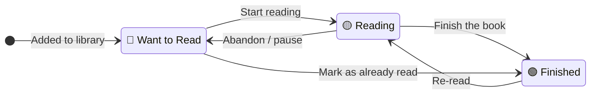
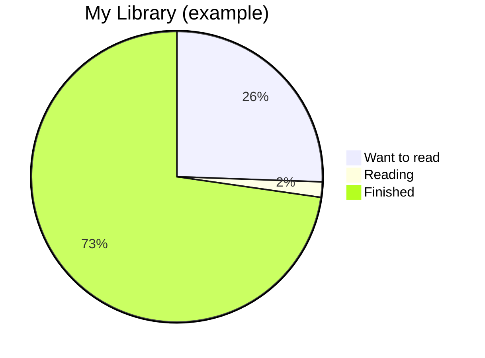

# Reading Progress

Track what you've read, what you're reading, and what's next — across your
whole library.

---

## Reading Statuses

Every book copy has one of three statuses:

| Status | Badge colour | Description |
|--------|-------------|-------------|
| **Want to Read** | 🔵 Blue | On your to-read list |
| **Reading** | 🟡 Yellow | Currently in progress |
| **Finished** | 🟢 Green | Completed (at least once) |

---

## Updating Reading Status

### From the book detail page

1. Open a book
2. Click the coloured status badge
3. Select the new status from the dropdown
4. The change is saved immediately

### From the book list

1. Hover over a book card
2. Click the status badge on the card
3. Select the new status

---

## Your Reading List

To see all books in your to-read pile:

1. Click **Library** in the sidebar
2. Click the **Want to Read** filter (or use the sidebar shortcut)

Books are sorted by date added by default — oldest first, so you tackle
the pile in the order you built it.

---

## Books Currently Reading

1. Click **Library** → **Reading** filter

You can have multiple books with "Reading" status at once — useful when
you're reading different books in different rooms.

---

## Who Read This Book (Library Reads)

The coloured **status** above is one value per book — it tells you whether
*the book* is being read. But in a shared library, more than one person can
read the same copy, at different times. Jinbocho tracks that separately.

On the book detail page, the **Read by** card lists every library member with
a toggle, showing their avatar if they've set one:

1. Open a book → scroll to **Read by**
2. Click **Mark read** next to your name once you've finished it
3. Your name now shows the date you marked it (e.g. *Carmelo · 2026-03-15*)
4. Click **Mark unread** to undo it

Each member's read is independent — two people can both mark the same copy
as read, each with their own date. The book's overall status updates
automatically:

- The **first** person to mark a copy as read sets the book's status to
  **Read** for everyone.
- If you **unmark** the last remaining read, the status falls back to
  **Want to Read**.

### The "currently reading" badge

When a book's status is **Reading**, the person who set it shows up as a
small 📖 badge next to the status badge (e.g. *📖 Carmelo*). This is who is
actively reading that specific copy right now — handy when several library
members share one physical book and want to know who has the bookmark.

---

## Reading History

All status changes are recorded in the **audit log** on each book's detail page.

| What's recorded | Example |
|----------------|----------|
| Status changed to Reading | 2026-03-01 · Carmelo started reading |
| Status changed to Finished | 2026-03-15 · Carmelo finished |
| Status changed back to Reading | 2026-09-01 · Carmelo re-reading |

This gives you a complete timeline for each book.

---

## Library Statistics

The **Stats** page (accessible from the sidebar) shows:

| Stat | Description |
|------|-------------|
| Total books | All owned copies in the library |
| Want to read | Your to-read pile |
| Reading | Books in progress |
| Finished | Completed books |
| Books this year | Books marked "finished" in the current calendar year |
| Average per month | Finished books / months since account created |

### Per-member stats

Below the library totals, a **Library members** card appears for each member,
with their avatar if they've set one, showing:

| Field | Description |
|-------|--------------|
| Books read | Count of copies that member has marked as read (see [Library Reads](#who-read-this-book-library-reads) above) |
| Books owned | Count of copies registered as owned by that member |
| Favorite genre | The genre that appears most often among that member's read books |

Each card links to a filtered list of that member's read or owned books.

### Annual reading goals

In **Settings → Profile**, every member can set an **Annual reading goal**
(how many books they want to read this calendar year). If a goal is set, the
Stats page shows a **Reading goals** section with a progress bar:
`<books read this year> / <goal>` for each member who has one configured.
Members without a goal don't appear in this section.

---

## Tips for Tracking Progress

=== "Daily reading habit"
    Mark a book as **Reading** when you start it. When you finish, change it
    to **Finished**. The audit log records the dates automatically — you get
    a reading duration without any extra steps.

=== "Re-reading a book"
    Books you've already finished can go back to **Reading** for a re-read.
    The audit log shows each reading cycle separately.

=== "Books you read before joining Jinbocho"
    Add the book and immediately set the status to **Finished**.
    The date will show as your join date, not the original reading date —
    but the book will correctly appear in your finished collection.

=== "Managing a big to-read pile"
    If your Want to Read list is overwhelming, use the **position** field
    creatively: assign your most-anticipated next reads to the top shelf
    of a dedicated "To Read" bookcase so they're always physically within reach.
