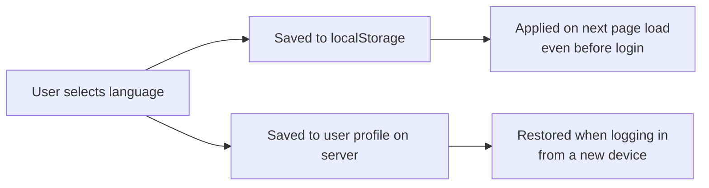

# Language & Localization

Jinbocho is fully translated into four languages. Each family member can
use the app in their preferred language.

---

## Supported Languages

| Language | Code | Coverage |
|----------|------|----------|
| 🇬🇧 English | `en` | 100% |
| 🇮🇹 Italian | `it` | 100% |
| 🇪🇸 Spanish | `es` | 100% |
| 🇫🇷 French | `fr` | 100% |

All screens, buttons, error messages, form validations, and notifications
are translated in all four languages.

---

## Changing Your Language

### From Profile

1. Click your name or avatar (top-right corner)
2. Select **Profile** (or **Profilo** / **Perfil** / **Profil**)
3. Under **Language**, select your preferred language from the dropdown
4. Click **Save** — the interface switches immediately

### From the Language Menu

A language selector is also available:

1. Click the globe icon (🌐) in the top-right corner
2. Select your language from the list
3. The change is applied immediately, no reload required

---

## How Language Preference is Saved

Your language preference is stored in two places:



- **localStorage** — the language is remembered in your browser, even before you log in
- **Server profile** — the language travels with your account to other devices

When you log in on a new device, the app uses your saved language preference automatically.

---

## Form Validation Messages

Validation messages (for example, "Title is required" or "Invalid email") are
also translated. They appear in the same language as the interface.

=== "English"
    ```
    Title is required.
    Email address is not valid.
    Password must be at least 8 characters.
    ```

=== "Italian"
    ```
    Il titolo è obbligatorio.
    L'indirizzo email non è valido.
    La password deve contenere almeno 8 caratteri.
    ```

=== "Spanish"
    ```
    El título es obligatorio.
    La dirección de correo no es válida.
    La contraseña debe tener al menos 8 caracteres.
    ```

=== "French"
    ```
    Le titre est obligatoire.
    L'adresse e-mail n'est pas valide.
    Le mot de passe doit contenir au moins 8 caractères.
    ```

---

## Mixed-Language Families

Each family member chooses their own language independently.
The library data (book titles, authors) is **not** translated —
it reflects whatever was stored when the book was added
(usually the language of the book itself).

The **interface** language is what changes per-user, not the content.

---

## Book Metadata Language vs Interface Language

These are two separate things:

| Thing | What it is | Set by |
|-------|-----------|--------|
| **Interface language** | The language of buttons, menus, messages | User preference |
| **Book language** | The language the book is written in | Set during book entry |

When filtering by "language", you filter by the **book's** language
(the language field in the metadata), not by your interface language.

---

## Reporting Translation Issues

If you find an incorrect or missing translation:

1. Open a GitHub issue
2. Include: the screen where you found it, your language setting, what you expected
3. Translations are in `jinbocho-fe/src/features/i18n/locales/` — contributions welcome!

### Translation files location

```
jinbocho-fe/src/features/i18n/locales/
├── en.json   ← English (reference)
├── it.json   ← Italian
├── es.json   ← Spanish
└── fr.json   ← French
```
