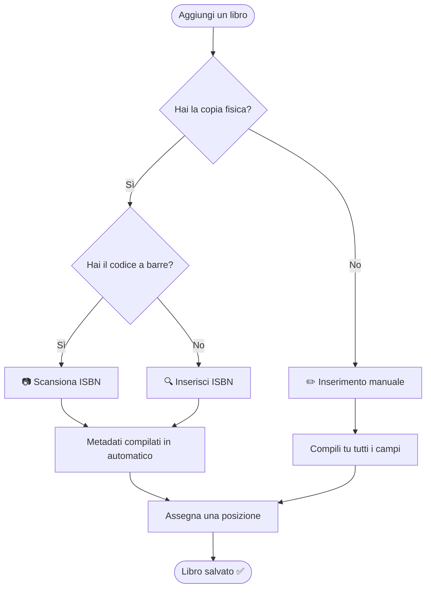

# Gestire la biblioteca

Tutto su come aggiungere, modificare e organizzare la tua collezione in Jinbocho.

---

## I tre modi per aggiungere un libro

---

## Metodo 1: scansione ISBN (il più veloce)

Il modo più rapido per aggiungere un libro che hai in mano.

### Passi

1. Clicca **"Aggiungi libro"** (pulsante + in alto a destra)
2. Tocca **"Scansiona ISBN"** — il browser chiederà l'accesso alla fotocamera
3. Punta la fotocamera sul codice a barre sul retro del libro
4. Jinbocho legge l'ISBN e cerca i metadati automaticamente
5. Controlla le informazioni (titolo, autore, editore, copertina)
6. Scegli la posizione (stanza → libreria → sezione → scaffale)
7. Clicca **"Salva"**

!!! tip "Consiglio per la fotocamera"
    Tieni il libro a 15–25 cm dalla fotocamera in buona illuminazione.
    Il codice a barre non deve essere perfettamente centrato — basta che sia interamente nel campo visivo.

Vedi la pagina dedicata **[Scansione ISBN](07-isbn-scanning.md)** per una guida dettagliata.

---

## Metodo 2: inserimento ISBN manuale

Usa questo metodo quando hai l'ISBN ma non riesci a usare la fotocamera.

1. Clicca **"Aggiungi libro"**
2. Seleziona **"Inserisci ISBN"**
3. Digita o incolla l'ISBN (10 o 13 cifre, con o senza trattini)
4. Clicca **"Cerca"** — i metadati vengono compilati automaticamente
5. Assegna una posizione e clicca **"Salva"**

!!! example "Formati ISBN accettati"
    Tutti e tre i formati sono validi:

    - `9788845292613`
    - `978-88-452-9261-3`
    - `8845292614` (ISBN a 10 cifre)

---

## Metodo 3: inserimento manuale

Per libri senza ISBN (edizioni antiche, manoscritti) o quando vuoi avere pieno controllo sui metadati.

1. Clicca **"Aggiungi libro"**
2. Seleziona **"Inserimento manuale"**
3. Compila i campi:

| Campo | Obbligatorio | Descrizione |
|-------|-------------|-------------|
| Titolo | ✅ | Titolo completo incluso il sottotitolo |
| Autore | ✅ | Uno o più autori |
| Lingua | ✅ | Lingua di pubblicazione |
| ISBN | — | Lascia vuoto se sconosciuto |
| Editore | — | Nome della casa editrice |
| Anno | — | Anno o data di pubblicazione |
| Pagine | — | Numero di pagine |
| Descrizione | — | Sinossi o note |

4. Assegna una posizione
5. Clicca **"Salva"**

---

## Se un libro è già presente nella biblioteca della famiglia

Qualunque metodo usi, Jinbocho controlla l'intera biblioteca della famiglia prima
di aggiungere un nuovo libro — non solo i tuoi libri. Se trova una corrispondenza
per **ISBN** o per **titolo e autore**, vedrai una finestra che ti indica:

- A quale libro esistente corrisponde
- Chi in famiglia possiede già una copia
- Dove è collocata quella copia

Questo è solo un avviso, non un blocco. Possedere due copie dello stesso libro
tra membri diversi della famiglia è comune ed è completamente supportato — ad
esempio, tu e il tuo partner potreste aver acquistato ciascuno la propria copia.
Puoi:

- **Confermare** — aggiungi comunque la tua copia, come libro separato nella biblioteca
- **Annullare** — torna indietro senza aggiungerlo, ad esempio se ti accorgi che è già tuo

---

## Modificare un libro

Per cambiare i metadati o spostare un libro su un altro scaffale:

1. Trova il libro nella biblioteca (cerca o naviga)
2. Clicca sulla scheda del libro per aprire il dettaglio
3. Clicca il pulsante **"Modifica"** (icona matita)
4. Cambia i campi che vuoi
5. Clicca **"Salva modifiche"**

---

## Spostare un libro in una nuova posizione

Puoi aggiornare la posizione senza modificare tutti i metadati:

1. Apri il dettaglio del libro
2. Clicca **"Cambia posizione"**
3. Seleziona stanza → libreria → sezione → scaffale → posizione
4. Conferma — lo spostamento viene registrato nello **storico**

---

## Eliminare un libro

Eliminare rimuove la copia fisica dalla tua biblioteca. Il record bibliografico (ISBN, titolo, autore) rimane nel database nel caso altri familiari abbiano lo stesso libro.

1. Apri il dettaglio del libro
2. Clicca **"Elimina"** (icona cestino)
3. Conferma nella finestra di dialogo

!!! danger "Questa operazione non può essere annullata"
    Una volta confermata, la copia viene rimossa definitivamente. Non esiste un cestino.

---

## Organizzare la biblioteca

Una volta aggiunti i libri, tienili in ordine:

- **Per posizione** — naviga la sezione Posizioni (barra laterale) per vedere tutti i libri in una stanza o libreria
- **Per stato di lettura** — filtra per "Da leggere", "In lettura", "Letto"
- **Con la ricerca** — trova qualsiasi libro in pochi secondi con la ricerca testuale

Vedi **[Ricerca e filtri](06-search-filters.md)** e **[Posizioni](04-locations.md)** per i dettagli.