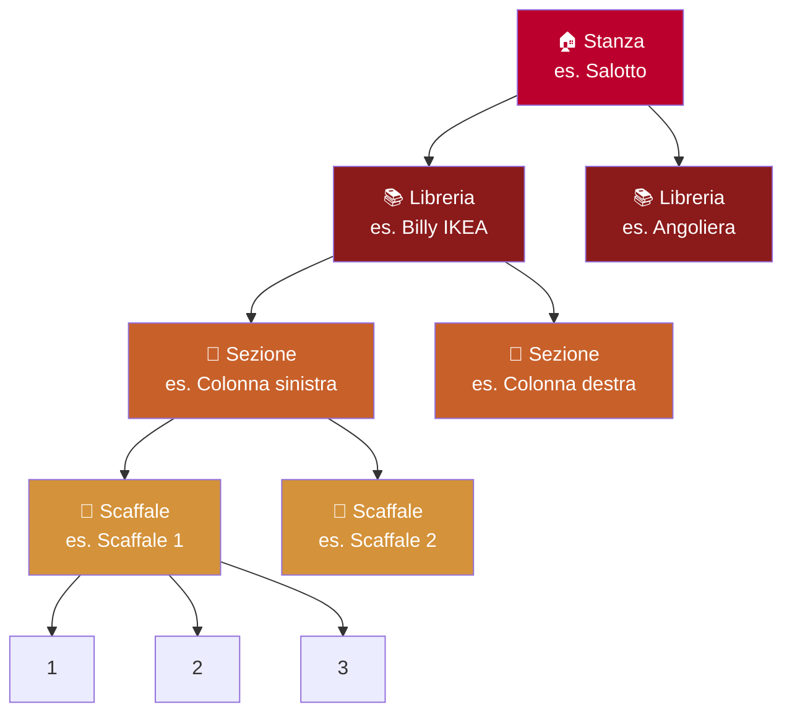

# Posizioni

Jinbocho riproduce la struttura fisica della tua casa così sai sempre dove si trova ogni libro.

---

## La gerarchia delle posizioni

La tua casa è rappresentata come un albero a quattro livelli:



| Livello | Cosa rappresenta | Esempio |
|---------|-----------------|--------|
| **Stanza** | Una stanza della tua casa | Salotto, Studio, Camera |
| **Libreria** | Un mobile nella stanza | Billy IKEA, Libreria in legno |
| **Sezione** | Una zona della libreria | Colonna sinistra, Piano superiore |
| **Scaffale** | Un singolo ripiano orizzontale | Scaffale 1, Scaffale 2 |
| **Posizione** | Uno slot numerato sullo scaffale | 1, 2, 3 … |

!!! info "I livelli intermedi sono opzionali"
    Se le tue librerie non hanno sezioni, puoi usare Stanza → Libreria → Scaffale
    senza creare Sezioni. Jinbocho si adatta alla struttura reale della tua casa.

---

## Configurare le posizioni

### Aggiungere una stanza

1. Apri la sezione **Posizioni** dalla barra laterale
2. Clicca **"+ Nuova stanza"**
3. Inserisci il nome e una descrizione opzionale
4. Clicca **"Salva"**

### Aggiungere una libreria

1. Naviga in una stanza
2. Clicca **"+ Nuova libreria"**
3. Inserisci il nome e le note opzionali
4. Clicca **"Salva"**

### Aggiungere una sezione

1. Naviga in una libreria
2. Clicca **"+ Nuova sezione"**
3. Inserisci un nome descrittivo (es. "Colonna sinistra", "Piano superiore")
4. Clicca **"Salva"**

### Aggiungere uno scaffale

1. Naviga in una sezione (o direttamente in una libreria se hai saltato le sezioni)
2. Clicca **"+ Nuovo scaffale"**
3. Inserisci il nome (es. "Scaffale 1") e la capienza opzionale
4. Clicca **"Salva"**

---

## Sfogliare i libri per posizione

### Vista ad albero

La barra laterale mostra l'albero completo delle posizioni. Clicca su qualsiasi nodo per vedere tutti i libri a quel livello:

- Clicca una **Stanza** → vedi tutti i libri in quella stanza
- Clicca una **Libreria** → vedi solo i libri di quella libreria
- Clicca uno **Scaffale** → vedi i libri in ordine di posizione

### Vista scaffale (con ordine)

Aprendo uno scaffale, i libri appaiono nel loro **ordine di posizione** — lo stesso ordine in cui sono fisicamente sullo scaffale. Utile quando sei davanti alla libreria e vuoi trovare un libro per numero di posto.

```
Scaffale 2 — Salotto › Billy › Colonna sinistra › Scaffale 2

 [1] Il nome della rosa      Umberto Eco
 [2] Il deserto dei Tartari  Dino Buzzati
 [3] Il barone rampante      Italo Calvino
 [4] —
 [5] Se questo è un uomo     Primo Levi
```

!!! tip "I gap nelle posizioni sono permessi"
    Le posizioni non devono essere consecutive. Lasciare la posizione 4 vuota significa
    che c'è fisicamente un gap sullo scaffale (un libro in prestito, per esempio).

---

## Modificare e rinominare una posizione

1. Naviga alla posizione che vuoi modificare
2. Clicca l'**icona matita** accanto al nome
3. Aggiorna il nome o la descrizione
4. Clicca **"Salva"**

---

## Eliminare una posizione

!!! warning "I libri devono essere spostati prima"
    Non puoi eliminare una stanza, libreria, sezione o scaffale che contiene ancora libri.
    Sposta o elimina prima tutti i libri.

1. Assicurati che la posizione sia vuota
2. Clicca l'**icona cestino** accanto al nome
3. Conferma l'eliminazione

---

## Consigli per organizzare le posizioni

=== "Biblioteca piccola (1–2 librerie)"

    Mantieni semplice:

    ```
    Stanza: Salotto
      Libreria: Libreria principale
        Scaffale 1 (A–G)
        Scaffale 2 (H–M)
        Scaffale 3 (N–Z)
    ```

=== "Biblioteca media (3–10 librerie)"

    Aggiungi sezioni per raggruppare gli scaffali:

    ```
    Stanza: Studio
      Libreria: Billy IKEA
        Sezione: Narrativa
          Scaffale 1, Scaffale 2, Scaffale 3
        Sezione: Saggistica
          Scaffale 1, Scaffale 2
      Libreria: Angoliera
        Scaffale 1 (Libri d'arte)
        Scaffale 2 (Fumetti)
    ```

=== "Biblioteca grande (10+ librerie)"

    Usa la gerarchia completa con più stanze:

    ```
    Stanza: Biblioteca
      Libreria: A (Classici)
      Libreria: B (Scienze)
      Libreria: C (Storia)
    Stanza: Camera
      Libreria: Comodino
    Stanza: Cameretta
      Libreria: Libri per bambini
    ```