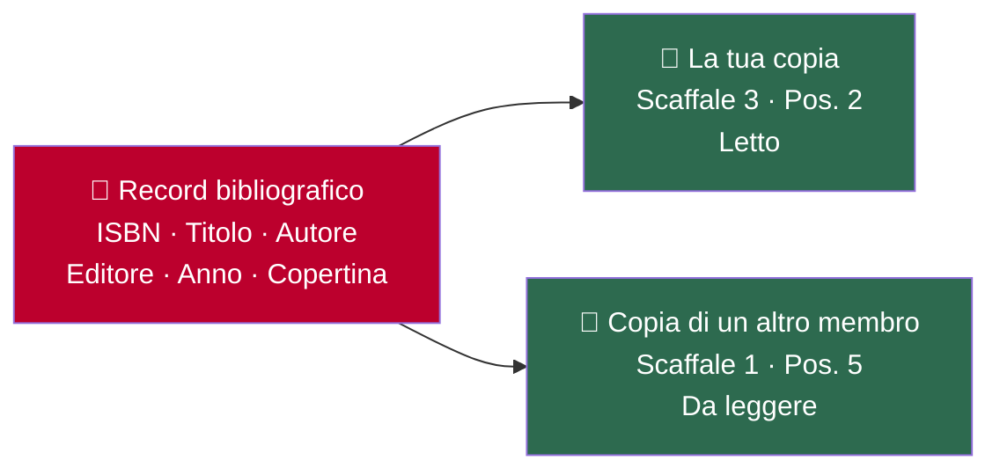
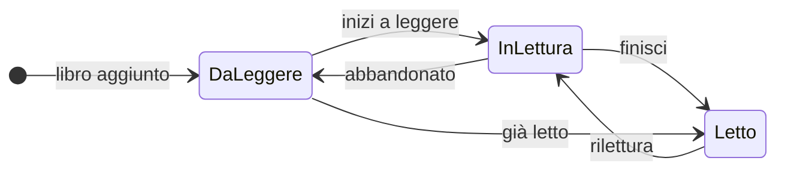

# Dettaglio libro

Ogni libro in Jinbocho ha due livelli di informazioni: il **record bibliografico** (cos'è il libro) e la **copia fisica** (la tua copia e la sua storia).

---

## Record bibliografico vs copia fisica

| Record bibliografico | Copia fisica (la tua) |
|---------------------|----------------------|
| Titolo, autore, ISBN | Su quale scaffale si trova |
| Editore, anno, pagine | Posizione sullo scaffale |
| Copertina, lingua | Stato di lettura |
| Descrizione, generi | Data aggiunta, ultimo spostamento |
| | Storico modifiche |

!!! info "Perché sono due cose separate?"
    Più membri della biblioteca possono avere la stessa copia di un libro. Ognuno ha il proprio record
    di copia (con il proprio stato di lettura e posizione), ma condividono un unico
    record bibliografico. Questo evita la duplicazione dei metadati.

---

## Aprire il dettaglio di un libro

Da qualsiasi lista o risultato di ricerca, clicca sulla scheda del libro. Il dettaglio mostra:

### Pannello sinistro — Metadati

- **Copertina** (miniatura, da Open Library o Google Books)
- **Titolo e autore**
- **ISBN** (13 cifre)
- **Editore** e **Anno**
- **Pagine**
- **Lingua**
- **Descrizione/sinossi**
- **Presentazione** — una breve sintesi senza spoiler per aiutarti a scegliere cosa leggere. Vedi **[Presentazione del libro](15-book-presentation.md)**.

### Pannello destro — La tua copia

- **Percorso posizione** — Stanza › Libreria › Sezione › Scaffale · Posizione X
- **Stato di lettura** (badge colorato)
- **Data di aggiunta**
- **Storico modifiche** (spostamenti e cambi di stato)

---

## Gli attributi della tua copia

Oltre alla posizione e allo stato di lettura, ogni copia posseduta ha dettagli
propri — separati dal record bibliografico, quindi non influenzano le altre
copie dello stesso libro possedute da altri membri della biblioteca:

| Campo | A cosa serve |
|-------|----------------|
| **Tag** | Etichette libere a tua scelta (es. "autografato", "da prestare", "preferito") — mostrate come badge nella pagina di dettaglio |
| **Condizione** | Nuovo, Buono, Discreto o Scadente |
| **Provenienza** | Acquistato, Regalo, Prestato o Altro |
| **Data d'acquisto** e **prezzo** | Opzionali, solo per i tuoi appunti |
| **Proprietario** | A quale membro della biblioteca appartiene questa copia fisica |
| **Note** | Note libere su questa copia specifica |

Per modificarli: apri la pagina di dettaglio libro → **Modifica** → vedi la
sezione **"Questa copia"** nel form di modifica (i campi sopra i dettagli
condivisi del libro).

### Chi la sta leggendo in questo momento

Se lo stato di una copia è **In lettura**, la pagina di dettaglio mostra un
badge 📖 — con l'avatar del membro, se ne ha impostato uno — vicino allo stato
con il nome del membro della biblioteca che la sta leggendo attualmente.
Questo è diverso dallo storico letture per membro — vedi
**[Progressi di lettura → Chi ha letto questo libro](10-reading-progress.md#chi-ha-letto-questo-libro-letture-di-biblioteca)**.

Se la copia è in prestito, un badge 📤 mostra chi la ha — vedi **[Prestiti](16-loans.md)**.

---

## Stato di lettura

Ogni copia ha uno dei tre stati:

| Stato | Colore | Significato |
|-------|--------|-------------|
| **Da leggere** | 🔵 Blu | Nella lista dei libri da leggere |
| **In lettura** | 🟡 Giallo | Attualmente in corso |
| **Letto** | 🟢 Verde | Completato |

### Cambiare lo stato di lettura

1. Apri il dettaglio del libro
2. Clicca sul badge stato
3. Seleziona il nuovo stato dal menu a tendina
4. Il cambio viene salvato immediatamente e registrato nello storico

---

## Valutazioni

Ogni copia posseduta può avere la tua **valutazione personale** a stelle,
separata dallo stato di lettura — puoi valutare un libro che hai finito, o uno
che stai ancora leggendo.

1. Apri la pagina di dettaglio del libro
2. Clicca sul widget di valutazione
3. Scegli una valutazione — viene salvata immediatamente

La pagina di dettaglio mostra anche la **valutazione media della biblioteca**
per quel titolo, aggregata tra tutti i membri che hanno valutato una copia.
La tua valutazione influisce solo sulla tua copia, non su quello che vedono
gli altri membri per le loro.

---

## Cambiare la posizione del libro

1. Apri il dettaglio del libro
2. Clicca **"Cambia posizione"** (o l'icona matita accanto al percorso)
3. Usa il selettore per scegliere:
   - Stanza, Libreria, Sezione, Scaffale, Posizione
4. Clicca **"Conferma spostamento"**

Lo spostamento viene registrato nello storico con la data e ora.

---

## Modificare i metadati

1. Apri il dettaglio del libro
2. Clicca **"Modifica"** (icona matita in alto)
3. Modifica i campi: titolo, autore, editore, anno, pagine, lingua, descrizione
4. Clicca **"Salva modifiche"**

---

## Storico modifiche

Ogni cambiamento al libro viene registrato:

| Evento | Cosa viene registrato |
|--------|----------------------|
| Libro aggiunto | Utente, data, posizione iniziale |
| Posizione cambiata | Vecchia → nuova posizione, utente, data |
| Stato di lettura cambiato | Vecchio → nuovo stato, utente, data |
| Metadati modificati | Quali campi sono cambiati, utente, data |

Lo storico è visibile in fondo alla pagina di dettaglio. Non può essere eliminato.

!!! tip "Utile per le biblioteche condivise"
    In una biblioteca condivisa, lo storico ti dice chi ha spostato un libro e quando —
    utile quando un libro non è al suo posto.

---

## Copertine

Le copertine vengono recuperate automaticamente durante la ricerca ISBN. Se manca:

1. Apri il dettaglio → **"Modifica"**
2. Incolla un URL diretto dell'immagine nel campo **"URL copertina"**
3. Clicca **"Salva modifiche"**

Formati accettati: JPEG, PNG, WebP. L'immagine non viene caricata su Jinbocho — viene presa dall'URL ogni volta che il libro viene visualizzato.