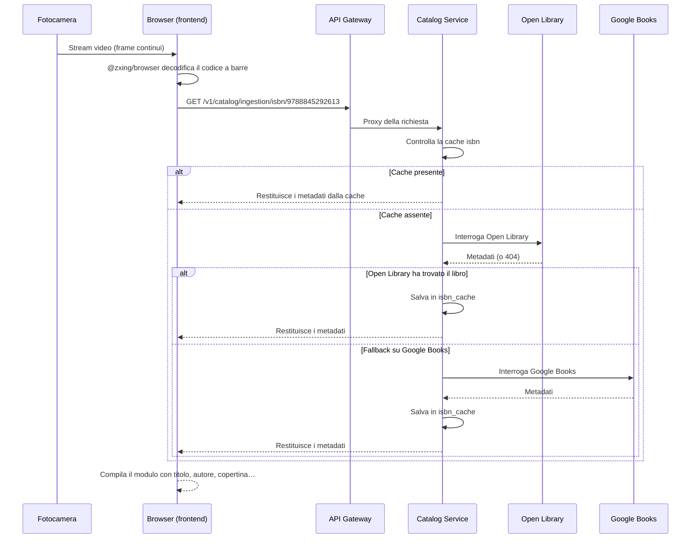

# Scansione ISBN

Lo scanner di codici a barre è il modo più veloce per aggiungere libri alla tua biblioteca. Jinbocho usa la fotocamera del dispositivo per leggere i codici a barre ISBN direttamente nel browser — nessuna installazione necessaria.

---

## Come funziona



---

## Avviare lo scanner

1. Clicca **"Aggiungi libro"** (il pulsante `+`)
2. Scegli **"Scansiona ISBN"**
3. Se è la prima volta, il browser chiederà il **permesso fotocamera** — clicca **"Consenti"**
4. Punta la fotocamera verso il codice a barre

### Permesso fotocamera

=== "Chrome / Edge"
    Appare una finestra di dialogo in alto a sinistra del browser.
    Clicca **"Consenti"**. Il permesso viene ricordato per il sito.

=== "Safari (macOS)"
    Safari chiede una volta per sessione. Clicca **"Consenti"** nella finestra.

=== "Safari (iOS)"
    Vai su **Impostazioni → Safari → Fotocamera** e imposta **"Consenti"**.

=== "Firefox"
    Clicca **"Consenti"** nella finestra che appare in cima alla pagina.

!!! warning "HTTPS richiesto"
    L'accesso alla fotocamera funziona solo con connessioni sicure (HTTPS).
    L'app Jinbocho in produzione usa sempre HTTPS. In sviluppo locale,
    usa `http://localhost` (i browser consentono la fotocamera su localhost senza HTTPS).

---

## Consigli per la scansione

### Distanza e angolazione

```
        ┌──────────────────────────────────────┐
        │                                      │
        │   ▐▌▐▌▐▌▐▌▐▌▐▌▐▌▐▌▐▌▐▌▐▌▐▌▐▌▐▌▐▌   │
        │   ▐▌▐▌▐▌▐▌▐▌▐▌▐▌▐▌▐▌▐▌▐▌▐▌▐▌▐▌▐▌   │
        │                                      │
        └──────────────────────────────────────┘
             ↑ ideale: codice a barre completamente visibile
```

| Cosa funziona | Cosa non funziona |
|--------------|-------------------|
| 15–25 cm di distanza | Troppo vicino (sfocato) |
| Codice a barre interamente nel campo visivo | Codice parzialmente tagliato |
| Buona illuminazione | Poca luce / riflessi |
| Telefono stabile (piccola pausa) | Tremito eccessivo |

!!! tip "Usa la fotocamera posteriore su mobile"
    La fotocamera posteriore ha un sensore molto migliore di quella anteriore.
    Jinbocho seleziona automaticamente la fotocamera posteriore su mobile.

### Se la scansione non funziona

1. **Pulisci l'obiettivo** — le impronte causano sfocatura
2. **Migliora l'illuminazione** — accendi una luce o avvicinati a una finestra
3. **Tieni il telefono più fermo** — appoggia il gomito a una superficie
4. **Prova una distanza diversa** — avvicinati o allontanati un po'
5. **Alternativa**: digita l'ISBN manualmente con **"Inserisci ISBN"**

---

## Cosa succede dopo una scansione riuscita

1. La vista fotocamera si chiude
2. Jinbocho mostra un indicatore di caricamento mentre cerca i metadati
3. Il **modulo "Aggiungi libro"** si apre con i campi precompilati:
   - Titolo, Autore/i, Editore, Anno, Pagine, Lingua, Copertina
4. Controlla le informazioni
5. Scegli la posizione (stanza → libreria → scaffale)
6. Clicca **"Salva"**

!!! note "Accuratezza dei metadati"
    I metadati ISBN provengono da Open Library e Google Books.
    Occasionalmente i dettagli sono incompleti o errati — puoi modificare
    qualsiasi campo prima di salvare.

---

## Scansione scaffale: fotografa un intero scaffale

Se l'AI è attiva sulla tua istanza Jinbocho, non devi scansionare i libri un
codice a barre alla volta. La **Scansione scaffale** legge ogni dorso in una
singola foto e propone ogni libro perché tu lo confermi.

!!! info "Richiede un'AI con modello capace di leggere immagini"
    La Scansione scaffale compare solo se il modulo AI della tua istanza è
    attivo **e** configurato con un modello capace di leggere immagini. Se non
    è disponibile, l'opzione non compare — chiedi al tuo amministratore, oppure
    usa la scansione ISBN normale sopra.

### Avviare una scansione scaffale

Puoi iniziare da due punti:

- **Mappa della libreria** — apri la mappa di una libreria, clicca **Scansiona**
  accanto allo scaffale che vuoi catalogare
- **Aggiungi libro → Scansiona un intero scaffale** — scegli prima lo scaffale, poi scatta la foto

### Passi

1. Scegli lo scaffale che stai fotografando (precompilato se sei partito dalla mappa)
2. Scatta **una foto** dello scaffale — su mobile si apre direttamente la fotocamera
3. Aspetta che l'AI legga i dorsi — per uno scaffale pieno può richiedere
   **un paio di minuti**, quindi non chiudere la scheda
4. Rivedi i risultati: ogni libro rilevato è mostrato in uno di questi stati:

    | Stato | Significato |
    |--------|-------------|
    | ✅ Trovato | L'AI è sicura di titolo e autore |
    | ⚠️ Incerto | L'AI ha un'ipotesi, ma vale la pena controllarla |
    | ❌ Non trovato | Un dorso è stato rilevato ma non identificato — modificalo a mano o saltalo |

5. Correggi titolo/autore dove serve, e deseleziona qualsiasi libro non vuoi aggiungere
6. I libri che sembrano duplicati — una copia che già possiedi, o lo stesso
   dorso rilevato due volte nella foto — sono segnalati ed esclusi dal
   conteggio di default; riselezionali se vuoi davvero aggiungere una seconda copia
7. Clicca **Aggiungi N libri** — ogni libro selezionato viene creato già
   posizionato su quello scaffale

!!! tip "Perché è più lenta di una singola scansione"
    Leggere la foto di un intero scaffale è un compito AI molto più pesante
    che cercare un singolo ISBN, per questo può richiedere uno o due minuti
    per uno scaffale pieno. È normale — lascia che finisca invece di riprovare.

### Se l'AI non è disponibile

A seconda di cosa è mal configurato, vedrai uno di questi messaggi al posto
del pulsante Scansiona o dopo averlo usato:

- *"La scansione fotografica AI non è configurata per questa biblioteca"* — il modulo AI non è attivo
- *"Il modello AI configurato non può leggere le foto"* — l'AI è attiva ma il modello in uso non supporta le immagini; chiedi all'amministratore di configurarne uno con supporto vision
- Un errore generico — l'AI è temporaneamente non disponibile; riprova più tardi, oppure aggiungi i libri manualmente

---

## Verifica scaffale: controlla uno scaffale già catalogato

La **Verifica scaffale** è l'opposto della Scansione scaffale: invece di
aggiungere nuovi libri, controlla uno scaffale **già** catalogato rispetto a
quello che c'è fisicamente ora, e ti dice cosa è cambiato.

1. Apri la Mappa della libreria, clicca **Verifica** accanto allo scaffale
2. Scatta una foto dello scaffale così com'è ora
3. Jinbocho confronta la foto con quanto registrato su quello scaffale e segnala:

    | Risultato | Significato | Cosa puoi fare |
    |--------|---------|-------------------|
    | **Mancante** | Catalogato su questo scaffale, ma non visto nella foto | Potrebbe essere stato spostato, prestato o perso — clicca **Visualizza** per controllare |
    | **Inatteso** | Visto nella foto, ma non catalogato su questo scaffale | Potrebbe essere fuori posto — **Aggiungi qui** se appartiene a questo scaffale, o **Cerca in biblioteca** per trovare dove dovrebbe stare |

Utile per scovare libri spostati fisicamente senza aggiornare Jinbocho, o
prestati e mai segnati come restituiti.

---

## Modalità scaffale: scansione rapida per uno scaffale

Se stai aggiungendo molti libri allo **stesso** scaffale e preferisci
scansionare i codici a barre invece di usare foto AI, la **Modalità scaffale**
blocca la posizione di destinazione per tutta la sessione, così non devi
sceglierla di nuovo dopo ogni libro:

1. Clicca **Aggiungi libro** → **Scansiona uno scaffale** (Modalità scaffale)
2. Scegli una volta sola stanza → libreria → sezione → scaffale
3. Scansiona (o digita) un ISBN dopo l'altro — ogni libro viene salvato
   direttamente su quello scaffale senza richiedere di nuovo la posizione
4. Chiudi la Modalità scaffale quando hai finito con quello scaffale

Se l'AI è disponibile, la Modalità scaffale offre anche una scorciatoia per
passare alla **Scansione scaffale** — scatta una sola foto dell'intero
scaffale e viene inviata direttamente al flusso di revisione della Scansione scaffale.

---

## Formati ISBN riconosciuti

| Formato | Esempio | Note |
|---------|---------|------|
| Codice a barre EAN-13 | Codice a barre standard sul retro del libro | La maggior parte dei libri moderni |
| ISBN-13 (testo) | `9788845292613` | Uguale a EAN-13, digitato |
| ISBN-10 (testo) | `8845292614` | Libri più vecchi, convertito internamente |
| Trattini ignorati | `978-88-452-9261-3` | I trattini vengono rimossi prima della ricerca |

---

## Quando un libro non viene trovato

Se l'ISBN non è in Open Library o Google Books, Jinbocho mostra:

> "Nessun metadato trovato per questo ISBN. Puoi aggiungere il libro manualmente."

Clicca **"Aggiungi manualmente"** per aprire il modulo di inserimento manuale con l'ISBN già precompilato. Inserisci tu titolo e autore.

Questo è normale per:

- Libri molto vecchi (precedenti al 1970)
- Edizioni regionali limitate
- Libri autopubblicati
- Libri di piccoli editori non presenti nei grandi database

---

## Nota sulla privacy

Il flusso video viene elaborato **interamente nel tuo browser** dalla libreria `@zxing/browser`. Nessun frame video viene inviato a nessun server. Solo il numero ISBN decodificato viene inviato all'API Jinbocho per cercare i metadati.