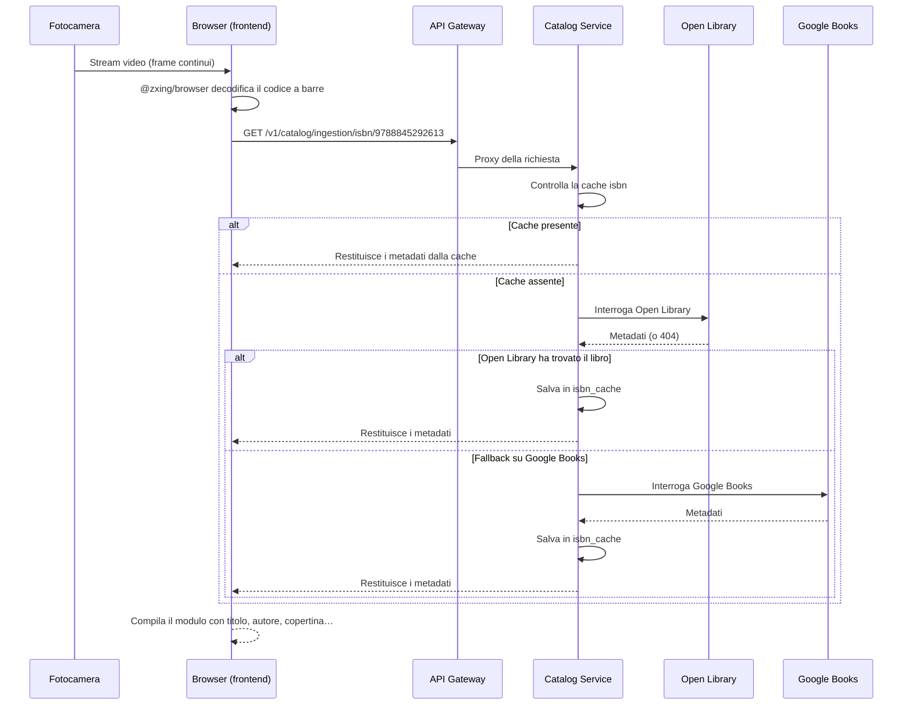

# Scansione ISBN

Lo scanner di codici a barre è il modo più veloce per aggiungere libri alla tua biblioteca. Jinbocho usa la fotocamera del dispositivo per leggere i codici a barre ISBN direttamente nel browser — nessuna installazione necessaria.

---

## Come funziona



---

## Avviare lo scanner

1. Clicca **"Aggiungi libro"** (il pulsante `+`)
2. Scegli **"Scansiona ISBN"**
3. Se è la prima volta, il browser chiederà il **permesso fotocamera** — clicca **"Consenti"**
4. Punta la fotocamera verso il codice a barre

### Permesso fotocamera

=== "Chrome / Edge"
    Appare una finestra di dialogo in alto a sinistra del browser.
    Clicca **"Consenti"**. Il permesso viene ricordato per il sito.

=== "Safari (macOS)"
    Safari chiede una volta per sessione. Clicca **"Consenti"** nella finestra.

=== "Safari (iOS)"
    Vai su **Impostazioni → Safari → Fotocamera** e imposta **"Consenti"**.

=== "Firefox"
    Clicca **"Consenti"** nella finestra che appare in cima alla pagina.

!!! warning "HTTPS richiesto"
    L'accesso alla fotocamera funziona solo con connessioni sicure (HTTPS).
    L'app Jinbocho in produzione usa sempre HTTPS. In sviluppo locale,
    usa `http://localhost` (i browser consentono la fotocamera su localhost senza HTTPS).

---

## Consigli per la scansione

### Distanza e angolazione

```
        ┌──────────────────────────────────────┐
        │                                      │
        │   ▐▌▐▌▐▌▐▌▐▌▐▌▐▌▐▌▐▌▐▌▐▌▐▌▐▌▐▌▐▌   │
        │   ▐▌▐▌▐▌▐▌▐▌▐▌▐▌▐▌▐▌▐▌▐▌▐▌▐▌▐▌▐▌   │
        │                                      │
        └──────────────────────────────────────┘
             ↑ ideale: codice a barre completamente visibile
```

| Cosa funziona | Cosa non funziona |
|--------------|-------------------|
| 15–25 cm di distanza | Troppo vicino (sfocato) |
| Codice a barre interamente nel campo visivo | Codice parzialmente tagliato |
| Buona illuminazione | Poca luce / riflessi |
| Telefono stabile (piccola pausa) | Tremito eccessivo |

!!! tip "Usa la fotocamera posteriore su mobile"
    La fotocamera posteriore ha un sensore molto migliore di quella anteriore.
    Jinbocho seleziona automaticamente la fotocamera posteriore su mobile.

### Se la scansione non funziona

1. **Pulisci l'obiettivo** — le impronte causano sfocatura
2. **Migliora l'illuminazione** — accendi una luce o avvicinati a una finestra
3. **Tieni il telefono più fermo** — appoggia il gomito a una superficie
4. **Prova una distanza diversa** — avvicinati o allontanati un po'
5. **Alternativa**: digita l'ISBN manualmente con **"Inserisci ISBN"**

---

## Cosa succede dopo una scansione riuscita

1. La vista fotocamera si chiude
2. Jinbocho mostra un indicatore di caricamento mentre cerca i metadati
3. Il **modulo "Aggiungi libro"** si apre con i campi precompilati:
   - Titolo, Autore/i, Editore, Anno, Pagine, Lingua, Copertina
4. Controlla le informazioni
5. Scegli la posizione (stanza → libreria → scaffale)
6. Clicca **"Salva"**

!!! note "Accuratezza dei metadati"
    I metadati ISBN provengono da Open Library e Google Books.
    Occasionalmente i dettagli sono incompleti o errati — puoi modificare
    qualsiasi campo prima di salvare.

---

## Formati ISBN riconosciuti

| Formato | Esempio | Note |
|---------|---------|------|
| Codice a barre EAN-13 | Codice a barre standard sul retro del libro | La maggior parte dei libri moderni |
| ISBN-13 (testo) | `9788845292613` | Uguale a EAN-13, digitato |
| ISBN-10 (testo) | `8845292614` | Libri più vecchi, convertito internamente |
| Trattini ignorati | `978-88-452-9261-3` | I trattini vengono rimossi prima della ricerca |

---

## Quando un libro non viene trovato

Se l'ISBN non è in Open Library o Google Books, Jinbocho mostra:

> "Nessun metadato trovato per questo ISBN. Puoi aggiungere il libro manualmente."

Clicca **"Aggiungi manualmente"** per aprire il modulo di inserimento manuale con l'ISBN già precompilato. Inserisci tu titolo e autore.

Questo è normale per:

- Libri molto vecchi (precedenti al 1970)
- Edizioni regionali limitate
- Libri autopubblicati
- Libri di piccoli editori non presenti nei grandi database

---

## Nota sulla privacy

Il flusso video viene elaborato **interamente nel tuo browser** dalla libreria `@zxing/browser`. Nessun frame video viene inviato a nessun server. Solo il numero ISBN decodificato viene inviato all'API Jinbocho per cercare i metadati.