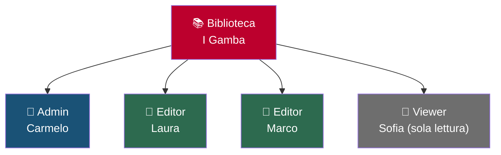
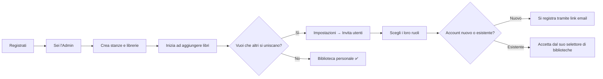

# Gestione utenti

Ogni collezione di libri in Jinbocho appartiene a una **biblioteca**, e più
persone possono usare la stessa biblioteca con diversi livelli di permesso.
Una singola persona può anche appartenere a più biblioteche contemporaneamente
— vedi **[Autenticazione → Appartenere a più biblioteche](02-authentication.md#appartenere-a-piu-biblioteche)**.

---

## Biblioteche e membri

Tutti i libri, le posizioni e la cronologia di lettura appartengono alla
**biblioteca** — non ai singoli utenti. Ogni membro vede la stessa
biblioteca. I ruoli controllano cosa può fare ciascuno, e sono impostati
**per biblioteca**: la stessa persona può essere Admin in una biblioteca e
Viewer in un'altra.

---

## Ruoli

| Ruolo | Può visualizzare | Può aggiungere/modificare libri | Può gestire le posizioni | Può gestire gli utenti | Può eliminare |
|------|---------|-------------------|---------------------|-----------------|------------|
| **Admin** | ✅ | ✅ | ✅ | ✅ | ✅ |
| **Editor** | ✅ | ✅ | ✅ | — | ✅ |
| **Viewer** | ✅ | — | — | — | — |

### Admin

Accesso completo a tutto, incluso invitare/rimuovere/sospendere membri ed
eliminare la biblioteca stessa. Ogni biblioteca deve avere almeno un Admin.
Il primo utente che registra una biblioteca ne è automaticamente l'Admin.

Usa questo ruolo per: la persona che gestisce la biblioteca.

### Editor

Può aggiungere, modificare, spostare ed eliminare libri. Può creare e
rinominare posizioni. Non può invitare nuovi membri, cambiare ruoli o
eliminare la biblioteca.

Usa questo ruolo per: i membri che curano attivamente la collezione.

### Viewer

Accesso in sola lettura. Può cercare e sfogliare l'intera biblioteca ma non
può fare modifiche.

Usa questo ruolo per: bambini, ospiti, o membri che vogliono solo consultare la biblioteca.

---

## Invitare un nuovo membro

!!! info "Serve un Admin"
    Solo gli Admin possono invitare nuovi membri.

1. Vai su **Impostazioni → Utenti**
2. Clicca **Invita utente**
3. Inizia a digitare nome o email della persona:
    - Se ha già un account Jinbocho, compare un elenco di suggerimenti —
      selezionala direttamente (vedrai un'etichetta "utente esistente", e non
      serve un campo nome separato)
    - Altrimenti, inserisci la sua email come testo libero
4. Scegli il ruolo: Admin, Editor o Viewer
5. Clicca **Invia invito**

**Cosa succede dopo dipende da se ha già un account:**

- **Nuova su Jinbocho**: riceve un'email con un link di registrazione. Creando
  il proprio account viene collegata automaticamente alla tua biblioteca.
- **Utente Jinbocho esistente**: non viene inviata alcuna email. L'invito
  compare sotto **Inviti in sospeso** al prossimo accesso al
  **[selettore di biblioteche](02-authentication.md#appartenere-a-piu-biblioteche)**
  — da lì può accettarlo o rifiutarlo.

!!! note "Consegna dell'email"
    Le email di invito possono finire nello spam. Chiedi alla persona invitata
    di controllare la cartella spam se non la riceve entro pochi minuti.

---

## Cambiare il ruolo di un membro

!!! info "Serve un Admin"

1. Vai su **Impostazioni → Utenti**
2. Trova il membro nell'elenco
3. Clicca il menu a tendina del ruolo accanto al suo nome
4. Seleziona il nuovo ruolo
5. Il cambio ha effetto immediato — la sua prossima richiesta userà il nuovo ruolo

Questo cambia il suo ruolo solo in **questa** biblioteca — se appartiene ad
altre, i ruoli lì restano invariati.

---

## Sospendere o rimuovere un membro

!!! info "Serve un Admin"

Jinbocho offre due modi per togliere l'accesso a un membro, a seconda che sia
temporaneo o permanente:

| Azione | Effetto | Reversibile |
|--------|--------|------------|
| **Sospendi** | L'iscrizione appare in grigio; il membro perde l'accesso a questa biblioteca ma resta nell'elenco | ✅ Riattivabile in qualsiasi momento, dallo stesso elenco Utenti |
| **Rimuovi** | L'iscrizione viene eliminata del tutto | ❌ Servirebbe un nuovo invito per rientrare |

Per sospendere o rimuovere:

1. Vai su **Impostazioni → Utenti**
2. Trova il membro nell'elenco
3. Clicca **Sospendi** o **Rimuovi** (icona cestino) accanto al suo nome
4. Conferma l'azione

!!! warning "Cosa succede ai suoi dati"
    Né sospendere né rimuovere un membro elimina libri o posizioni. I libri
    che ha aggiunto restano nella biblioteca. Le sue voci nello storico
    restano per tracciabilità, e prestiti/letture passate mantengono il suo nome.

Un membro sospeso vede la sua biblioteca in grigio con l'etichetta
**"Sospesa"** nel proprio selettore di biblioteche, senza modo di entrarci,
finché un Admin non lo riattiva.

---

## Profili dei membri

Ogni membro ha una pagina profilo, raggiungibile da **Impostazioni → Utenti**
(clicca sul suo nome) o cliccando il suo nome ovunque sia mostrato come link —
per esempio il nome di un richiedente collegato in un prestito (vedi
**[Prestiti](16-loans.md)**).

### Il tuo profilo

Clicca il tuo nome o avatar (in alto a destra) → **Profilo**. Puoi aggiornare:

- **Nome visualizzato**
- **Avatar** — carica una foto (JPEG/PNG/WebP) o rimuovila
- **Lingua dell'interfaccia e tema** (vedi **[Lingua e aspetto](12-localization.md)**)
- **Obiettivo di lettura annuale** — un numero opzionale di libri che vuoi
  finire quest'anno; se impostato, compare come barra di avanzamento nella
  **[pagina Statistiche](10-reading-progress.md#statistiche-della-biblioteca)**
- **Indirizzo email**

Clicca **Salva** per applicare le modifiche.

### Il profilo di un altro membro

Qualsiasi membro attivo può visualizzare il profilo di un altro membro — è in
sola lettura e mostra il suo avatar, nome, email, ruolo in questa biblioteca e
da quanto tempo è membro. Non c'è un blocco separato per gli Admin per
visualizzarlo (a differenza dell'elenco completo **Utenti**, riservato agli Admin).

---

## Cambiare la password

1. Clicca il tuo nome o avatar → **Profilo**
2. Clicca **Cambia password**
3. Inserisci la password attuale
4. Inserisci e conferma la nuova password
5. Clicca **Aggiorna password**

!!! tip "Requisiti della password"
    Le password devono avere almeno 8 caratteri. Usare una passphrase lunga
    (es. "BibliotecaDellInverno2026!") è meglio di una stringa corta casuale.

---

## Impostazioni della biblioteca

Gli Admin possono aggiornare le impostazioni a livello di biblioteca:

1. Vai su **Impostazioni**
2. Nella sezione **Biblioteca**, aggiorna:
   - **Nome biblioteca** (mostrato in cima alla biblioteca)
   - **Descrizione** (note opzionali sulla biblioteca)
3. Clicca **Salva**

---

## Sicurezza: sessioni

Jinbocho usa token JWT per l'autenticazione. La tua sessione si aggiorna
automaticamente mentre sei attivo. Dopo 30 minuti di inattività, dovrai
accedere di nuovo.

Per terminare la sessione sul dispositivo corrente, usa **Esci** dalla pagina
Impostazioni. Ogni dispositivo mantiene il proprio token di sessione —
disconnettersi da uno non influisce sugli altri.

---

## Primo setup: costruire la biblioteca

