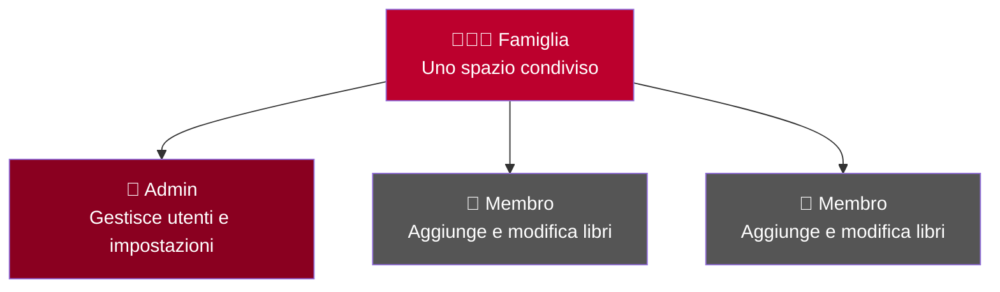

# Gestione utenti

Jinbocho è progettato per le famiglie: ogni famiglia ha un proprio spazio con più utenti, ciascuno con il proprio ruolo.

---

## Struttura famiglia / utenti

| Livello | Chi è | Cosa può fare |
|---------|-------|---------------|
| **Famiglia** | L'account condiviso | Contiene tutti gli utenti e i libri |
| **Admin** | L'utente che ha creato la famiglia (o promosso) | Tutto: gestisce utenti, ruoli, impostazioni famiglia |
| **Membro** | Utenti invitati | Aggiunge, modifica ed elimina libri |

---

## Impostazioni famiglia

### Accedere alle impostazioni

1. Clicca sull'**icona ingranaggio** (in basso a sinistra)
2. Seleziona **"Impostazioni famiglia"**

Da qui puoi aggiornare:

- **Nome della famiglia** (es. "Famiglia Rossi", "Studio di Mario")
- **Email di contatto** per la famiglia

---

## Invitare un nuovo membro

!!! info "Solo gli Admin possono invitare"
    La funzione di invito è visibile solo agli utenti con ruolo Admin.

1. Apri **Impostazioni → Gestione membri**
2. Clicca **"Invita membro"**
3. Inserisci l'**email** del nuovo membro
4. Seleziona il **ruolo** (Membro o Admin)
5. Clicca **"Invia invito"**

Il nuovo utente riceverà un'email con le istruzioni per creare il proprio account e unirsi alla famiglia.

---

## Modificare il ruolo di un utente

1. Apri **Impostazioni → Gestione membri**
2. Trova l'utente nell'elenco
3. Clicca **"Modifica ruolo"** accanto al suo nome
4. Seleziona il nuovo ruolo
5. Clicca **"Salva"**

!!! warning "Promuovere ad Admin"
    Promuovere un utente ad Admin gli dà pieno controllo della famiglia, inclusa la possibilità
    di rimuovere altri admin (incluso te). Fallo solo con persone di cui ti fidi.

---

## Rimuovere un membro

1. Apri **Impostazioni → Gestione membri**
2. Clicca **"Rimuovi"** accanto all'utente
3. Conferma nella finestra di dialogo

!!! note "I libri rimangono"
    Rimuovere un membro dalla famiglia non elimina i suoi libri. Le copie fisiche che ha aggiunto
    rimangono nella biblioteca.

---

## Gestire il tuo profilo

1. Clicca sul tuo **nome utente** (in alto a destra) o sull'**icona utente**
2. Seleziona **"Profilo"**

Da qui puoi modificare:

- **Nome visualizzato**
- **Password**
- **Lingua dell'interfaccia** (vedi [Lingua e localizzazione](12-localization.md))

### Cambiare la password

1. Apri il tuo profilo
2. Clicca **"Cambia password"**
3. Inserisci la **password attuale**
4. Inserisci la **nuova password** (minimo 8 caratteri)
5. Conferma la nuova password
6. Clicca **"Salva"**

---

## Ruoli e permessi — riepilogo

| Azione | Membro | Admin |
|--------|--------|-------|
| Visualizzare tutti i libri | ✅ | ✅ |
| Aggiungere libri | ✅ | ✅ |
| Modificare libri | ✅ | ✅ |
| Eliminare libri | ✅ | ✅ |
| Gestire le posizioni | ✅ | ✅ |
| Invitare nuovi membri | — | ✅ |
| Cambiare i ruoli | — | ✅ |
| Rimuovere membri | — | ✅ |
| Modificare le impostazioni famiglia | — | ✅ |