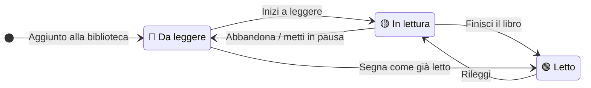
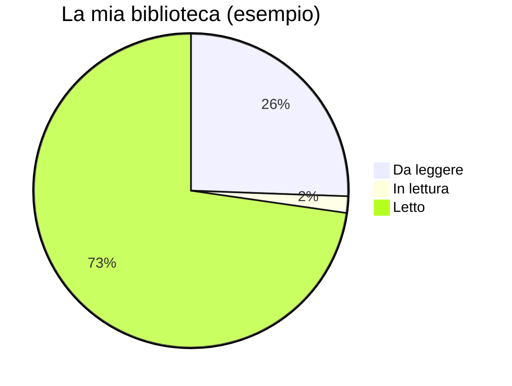

# Progressi di lettura

Tieni traccia di cosa hai letto, cosa stai leggendo e cosa ti aspetta — in tutta
la biblioteca.

---

## Stati di lettura

Ogni copia di un libro ha uno di tre stati:

| Stato | Colore badge | Descrizione |
|--------|-------------|-------------|
| **Da leggere** | 🔵 Blu | Nella tua lista dei libri da leggere |
| **In lettura** | 🟡 Giallo | Attualmente in corso |
| **Letto** | 🟢 Verde | Completato (almeno una volta) |

---

## Aggiornare lo stato di lettura

### Dalla pagina di dettaglio del libro

1. Apri un libro
2. Clicca il badge colorato dello stato
3. Seleziona il nuovo stato dal menu a tendina
4. La modifica viene salvata immediatamente

### Dalla lista libri

1. Passa il mouse su una scheda libro
2. Clicca il badge dello stato sulla scheda
3. Seleziona il nuovo stato

---

## La tua lista "Da leggere"

Per vedere tutti i libri nella tua pila da leggere:

1. Clicca **Biblioteca** nella barra laterale
2. Clicca il filtro **Da leggere** (o usa la scorciatoia nella barra laterale)

I libri sono ordinati per data di aggiunta — prima i più vecchi, così affronti
la pila nell'ordine in cui l'hai costruita.

---

## Libri attualmente in lettura

1. Clicca **Biblioteca** → filtro **In lettura**

Puoi avere più libri con stato "In lettura" contemporaneamente — utile quando
leggi libri diversi in stanze diverse.

---

## Chi ha letto questo libro (Letture di biblioteca)

Lo **stato** colorato visto sopra è un valore unico per libro — indica se
*il libro* viene letto. Ma in una biblioteca condivisa, più persone possono
leggere la stessa copia, in momenti diversi. Jinbocho tiene traccia di questo
separatamente.

Nella pagina di dettaglio del libro, la card **Letto da** elenca ogni membro
della biblioteca con un interruttore, mostrando il suo avatar se ne ha impostato uno:

1. Apri un libro → scorri fino a **Letto da**
2. Clicca **Segna come letto** vicino al tuo nome una volta finito
3. Il tuo nome mostra ora la data in cui l'hai segnato (es. *Carmelo · 2026-03-15*)
4. Clicca **Segna come non letto** per annullare

La lettura di ogni membro è indipendente — due persone possono entrambe
segnare la stessa copia come letta, ciascuna con la propria data. Lo stato
generale del libro si aggiorna automaticamente:

- La **prima** persona che segna una copia come letta porta lo stato del
  libro a **Letto** per tutti.
- Se **togli il segno** all'ultima lettura rimasta, lo stato torna a
  **Da leggere**.

### Il badge "in lettura ora"

Quando lo stato di un libro è **In lettura**, la persona che l'ha impostato
compare come piccolo badge 📖 vicino al badge di stato (es. *📖 Carmelo*).
Indica chi sta leggendo attivamente quella copia in questo momento — utile
quando più membri della biblioteca condividono una copia fisica e vogliono
sapere chi ha il segnalibro.

---

## Storico delle letture

Tutti i cambi di stato sono registrati nel **log attività** sulla pagina di
dettaglio di ogni libro.

| Cosa viene registrato | Esempio |
|----------------|----------|
| Stato cambiato a In lettura | 2026-03-01 · Carmelo ha iniziato a leggere |
| Stato cambiato a Letto | 2026-03-15 · Carmelo ha finito |
| Stato tornato a In lettura | 2026-09-01 · Carmelo sta rileggendo |

Questo ti dà una linea temporale completa per ogni libro.

---

## Statistiche della biblioteca

La pagina **Statistiche** (accessibile dalla barra laterale) mostra:

| Statistica | Descrizione |
|------|-------------|
| Totale libri | Tutte le copie possedute nella biblioteca |
| Da leggere | La tua pila da leggere |
| In lettura | Libri in corso |
| Letto | Libri completati |
| Libri quest'anno | Libri segnati "letto" nell'anno solare corrente |
| Media al mese | Libri letti / mesi da quando hai creato l'account |

### Statistiche per membro

Sotto i totali della biblioteca, compare una card **Membri della biblioteca**
per ciascun membro, con il suo avatar se ne ha impostato uno, che mostra:

| Campo | Descrizione |
|-------|--------------|
| Libri letti | Conteggio delle copie che quel membro ha segnato come lette (vedi [Letture di biblioteca](#chi-ha-letto-questo-libro-letture-di-biblioteca) sopra) |
| Libri posseduti | Conteggio delle copie registrate come possedute da quel membro |
| Genere preferito | Il genere che compare più spesso tra i libri letti da quel membro |

Ogni card è collegata a una lista filtrata dei libri letti o posseduti da
quel membro.

### Obiettivi di lettura annuali

In **Impostazioni → Profilo**, ogni membro può impostare un **obiettivo di
lettura annuale** (quanti libri vuole leggere in quell'anno solare). Se è
impostato un obiettivo, la pagina Statistiche mostra una sezione
**Obiettivi di lettura** con una barra di avanzamento:
`<libri letti quest'anno> / <obiettivo>` per ogni membro che ne ha
configurato uno. I membri senza obiettivo non compaiono in questa sezione.

---

## Consigli per tracciare i progressi

=== "Abitudine di lettura quotidiana"
    Segna un libro come **In lettura** quando lo inizi. Quando lo finisci,
    cambia lo stato in **Letto**. Il log attività registra le date
    automaticamente — ottieni una durata di lettura senza passi extra.

=== "Rileggere un libro"
    I libri già finiti possono tornare a **In lettura** per una rilettura.
    Il log attività mostra ogni ciclo di lettura separatamente.

=== "Libri letti prima di usare Jinbocho"
    Aggiungi il libro e imposta subito lo stato su **Letto**.
    La data mostrata sarà quella di iscrizione, non quella di lettura
    originale — ma il libro apparirà correttamente nella tua collezione
    di libri letti.

=== "Gestire una pila 'Da leggere' enorme"
    Se la tua lista Da leggere è sovraccarica, usa il campo **posizione**
    in modo creativo: assegna le letture più attese al ripiano più in alto
    di una libreria dedicata "Da leggere" così le hai sempre a portata di mano.
