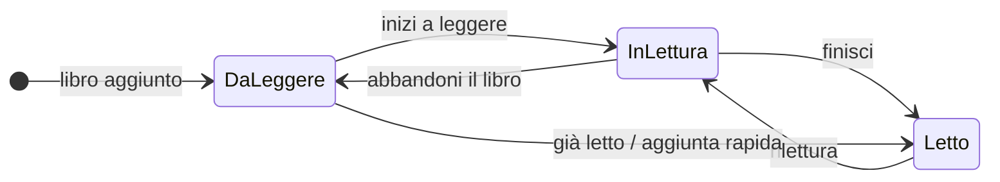
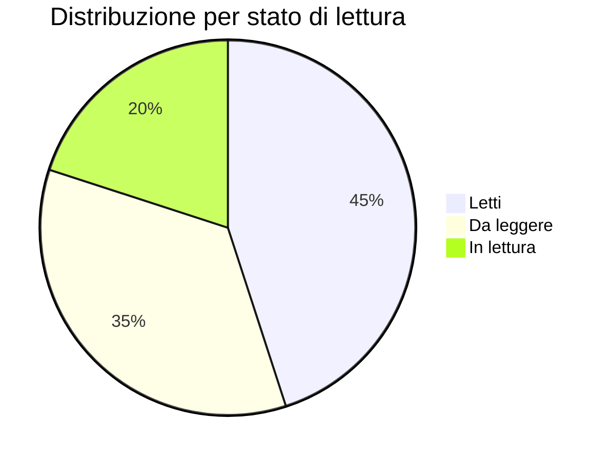

# Progressi di lettura

Jinbocho tiene traccia dello stato di lettura di ogni libro nella tua biblioteca. Con tre stati semplici puoi sapere sempre cosa hai letto, cosa stai leggendo e cosa ti aspetta.

---

## I tre stati di lettura



| Stato | Significato | Badge |
|-------|-------------|------|
| **Da leggere** | Nella lista dei libri da leggere | 🔵 Blu |
| **In lettura** | Libro attualmente in corso | 🟡 Giallo |
| **Letto** | Completato | 🟢 Verde |

---

## Cambiare lo stato

### Dalla lista libri

Il modo più veloce: usa il **menu a tendina** direttamente nella scheda del libro nella lista.

1. Vai su **Biblioteca** (barra laterale)
2. Trova il libro
3. Clicca il menu a tendina dello stato (badge colorato)
4. Seleziona il nuovo stato

Il cambio è immediato — nessun salvataggio richiesto.

### Dal dettaglio del libro

1. Apri il dettaglio del libro (clicca sulla scheda)
2. Clicca il badge dello stato di lettura
3. Seleziona il nuovo stato dal menu

---

## Filtrare per stato di lettura

Vedi solo i libri di un certo stato:

1. Apri **Biblioteca**
2. Clicca **"Filtri"**
3. Seleziona lo stato: Da leggere · In lettura · Letto

Oppure clicca direttamente le scorciatoie nella barra laterale:

- **In lettura** — mostra subito tutti i libri in corso
- **Da leggere** — la tua pila di libri in attesa

---

## Statistiche della biblioteca

La pagina **Dashboard** mostra un riepilogo visivo della tua biblioteca:



Le statistiche includono:

| Metrica | Descrizione |
|---------|-------------|
| Totale libri | Numero totale di copie fisiche |
| Letti | Libri con stato "Letto" |
| In lettura | Libri attualmente in corso |
| Da leggere | Libri in lista d'attesa |
| Aggiunti questo mese | Libri aggiunti negli ultimi 30 giorni |

!!! note "Le statistiche sono personali"
    Le statistiche mostrano i dati dell'intera biblioteca di famiglia. Non è ancora possibile
    filtrare per singolo membro.

---

## Storico delle modifiche

Ogni cambio di stato viene registrato nel **log attività** del libro:

```
● 2024-03-15 — Stato cambiato: Da leggere → In lettura  (Marco)
● 2024-01-10 — Libro aggiunto in Da leggere             (Laura)
```

Questo log è visibile nella pagina di dettaglio del libro, in fondo alla pagina.
È permanente e non può essere modificato.

---

## Consigli per usare gli stati

=== "Aggiungi i libri già letti"
    Quando aggiungi libri che hai già letto, imposta subito lo stato su **"Letto"**.
    Questo rende le tue statistiche accurate fin dall'inizio.

=== "Usa 'In lettura' per un solo libro alla volta"
    Funziona bene per capire a colpo d'occhio qual è il libro che stai leggendo in questo momento.
    Se leggi più libri in parallelo, imposta tutti su "In lettura".

=== "La pila 'Da leggere'"
    Aggiungi tutti i libri che vuoi leggere con stato "Da leggere".
    Usa la vista filtrata per vedere la tua pila e scegliere il prossimo libro.

=== "Riletture"
    Se rileggi un libro già marcato "Letto", portalo di nuovo su "In lettura".
    Il log registrerà la data della rilettura.