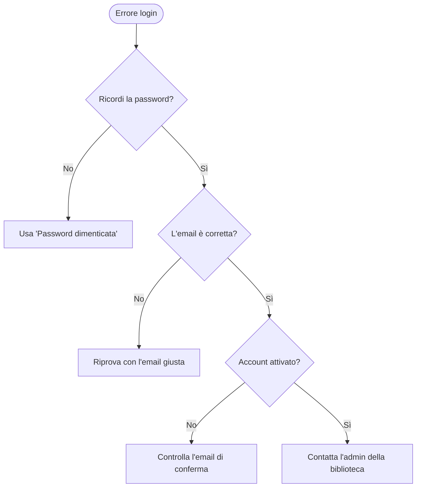

# Risoluzione dei problemi

Soluzioni ai problemi più comuni con Jinbocho.

---

## Problemi di accesso

### Non riesco ad accedere — "Credenziali non valide"

- Verifica che non ci siano spazi prima o dopo l'email/password
- Controlla che il **Caps Lock** non sia attivo
- Usa **"Password dimenticata"** per reimpostare la password via email

### La sessione scade continuamente

I token di accesso durano poche ore. Se la sessione scade prima del previsto:

- Assicurati che il browser non stia eliminando i cookie di sessione
- In Safari: **Impostazioni → Safari → Blocca tutti i cookie** deve essere disattivo
- Disattiva estensioni del browser che cancellano la cache automaticamente

---

## Problemi con la scansione ISBN

### La fotocamera non si avvia

1. Controlla che il browser abbia il **permesso fotocamera**:
   - Chrome/Edge: clicca l'icona lucchetto nella barra degli indirizzi → Fotocamera → Consenti
   - Safari iOS: Impostazioni iPhone → Safari → Fotocamera → Consenti
   - Firefox: clicca l'icona fotocamera nella barra degli indirizzi
2. Verifica di star usando **HTTPS** (non HTTP)
3. Ricarica la pagina e riprova

### La fotocamera si avvia ma non legge il codice

| Problema | Soluzione |
|---------|----------|
| Codice sfocato | Allontana il telefono di qualche centimetro |
| Poca luce | Accendi una luce o avvicinati a una fonte di luce |
| Riflessi sul codice | Cambia angolazione leggermente |
| Codice danneggiato | Usa l'inserimento ISBN manuale |

### Il libro non viene trovato dopo la scansione

- L'ISBN è presente nel codice a barre ma il libro non è nel database Open Library o Google Books
- Clicca **"Aggiungi manualmente"** e inserisci tu i dati

---

## Problemi di caricamento e performance

### La pagina è lenta o non carica

1. Verifica la **connessione internet** (apri un altro sito per testare)
2. **Ricarica la pagina** (Ctrl+R / Cmd+R)
3. **Svuota la cache** del browser:
   - Chrome: Ctrl+Shift+Delete → Immagini e file in cache → Cancella
   - Safari: Sviluppo → Svuota cache (o Impostazioni → Cancella cronologia)
4. Prova in una **finestra di navigazione in incognito**
5. Prova con un **browser diverso**

### Le modifiche non vengono salvate

- Controlla di aver cliccato **"Salva"** o **"Conferma"** (non chiudere la finestra prima)
- Se compare un messaggio di errore, leggi il testo — di solito indica il problema (campo obbligatorio mancante, valore non valido, ecc.)
- Se il problema persiste, ricarica la pagina — potrebbe essere un problema di connessione momentaneo

---

## Errori specifici

### "Errore 401 — Non autorizzato"

La sessione è scaduta o il token non è valido. **Fai logout e accedi di nuovo.**

### "Errore 403 — Accesso negato"

Non hai i permessi per questa azione. Possibile che:
- Stai cercando di fare qualcosa riservato agli Admin (es. invitare un membro)
- Il tuo ruolo è stato cambiato da un Admin

### "Errore 404 — Non trovato"

La risorsa non esiste più (libro eliminato, posizione rimossa, ecc.). Torna alla pagina precedente.

### "Errore 500 — Errore del server"

Problema temporaneo lato server. Riprova dopo qualche minuto.

### "Nessun metadato trovato per questo ISBN"

Il libro non è nel database pubblico. Aggiungi il libro **manualmente** — l'ISBN verrà comunque salvato nel record.

---

## Problemi con le posizioni

### Non riesco a eliminare una stanza / libreria / scaffale

Non puoi eliminare una posizione che contiene ancora libri. Prima devi:

1. Spostare i libri in un'altra posizione (dalla pagina di dettaglio di ogni libro → "Cambia posizione")
2. Oppure eliminare i libri
3. Poi ritenta l'eliminazione della posizione

### I libri non appaiono nella posizione giusta

- Controlla il percorso posizione nella pagina di dettaglio del libro
- Potrebbe esserci una confusione tra due scaffali con nomi simili
- Usa la ricerca per trovare il libro e verifica il percorso completo

---

## Supporto

Se il problema non è in questa pagina:

1. **Ricarica la pagina** — molti problemi si risolvono così
2. **Prova in incognito** — elimina le variabili legate alla cache
3. **Descrivi il problema** con:
   - Cosa stavi cercando di fare
   - Cosa è successo invece
   - Il browser e il sistema operativo che stai usando
   - Un eventuale messaggio di errore
4. **Segnala il bug** su GitHub → Issues

!!! tip "Cattura lo schermo"
    Quando segnali un bug, uno screenshot o una registrazione dello schermo aiutano moltissimo
    a capire il problema. Usa lo strumento di cattura schermo del tuo sistema operativo.
